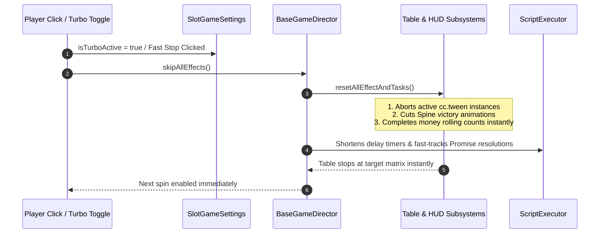

# ⚡ Turbo Mode & Fast-To-Result (`skipAllEffects`)

<!-- convention-summary-start -->
### Turbo Mode & Fast-To-Result (skipAllEffects) Summary

- **Core Architecture / Purpose**: Technical reference, API contract, and integration guide for Turbo Mode & Fast-To-Result (skipAllEffects).
- **Key Mechanisms & Design**: Encapsulates core algorithms, event hooks, and performance optimizations within the slot framework runtime.
- **Domain Capabilities**: cc_slot_module, 04_script_execution_pipeline
- **Scope & Code Paths**: `assets/cc-common/cc-slot-module/`
- **Related Docs**: [Master Index](../INDEX.md)
<!-- convention-summary-end -->

---

## 1. Fast Stop & Turbo Execution Flow

When Turbo mode is enabled or when the player taps the screen to fast-stop an active spin, the framework accelerates the timeline through **Fast-To-Result (FTR)**:

---

## 2. Granular Subsystem Acceleration Breakdown

### 1. Table & Reel Subsystem (`SlotTableModule`)
* **Normal Mode**: Reels decelerate sequentially with column-by-column delays ($0.2\text{s}$ per reel) and bounce landing curves (`easeBackOut`).
* **Turbo / Fast Stop Mode**: Delays between columns are set to $0\text{s}$, and deceleration curves are shortened to immediate snap-stops ($<0.1\text{s}$).

### 2. Payline & Win Presentation Subsystem (`PaylineInfoModule`)
* **Normal Mode**: Blinks all winning paylines for $2.0\text{s}$, then enters cyclical single-line presentation.
* **Turbo Mode**: Skips cyclical line blinking entirely, displaying final total win instantly.

### 3. Wallet & Win Amount Rolling (`WalletModule` & `WinAmountModule`)
* **Normal Mode**: Performs numeric count-up tween over $1.5\text{s} - 4.0\text{s}$ using `MoneyTween`.
* **Turbo Mode**: Sets label text directly to target total without tween delay.

---

## 3. Developer Invariant Rules for Fast Stop

1. **Always Implement `resetAllEffectAndTasks()`**: Custom game components must override `resetAllEffectAndTasks()` to cancel local tweens, stop custom Spine skeleton tracks, and clear timeout callbacks (`this.unscheduleAllCallbacks()`).
2. **Never Leave Unresolved Promises**: Any visual promise that is interrupted by `skipAllEffects()` must invoke its `resolve()` callback rather than remaining pending forever, ensuring `ScriptExecutor` can progress cleanly.
