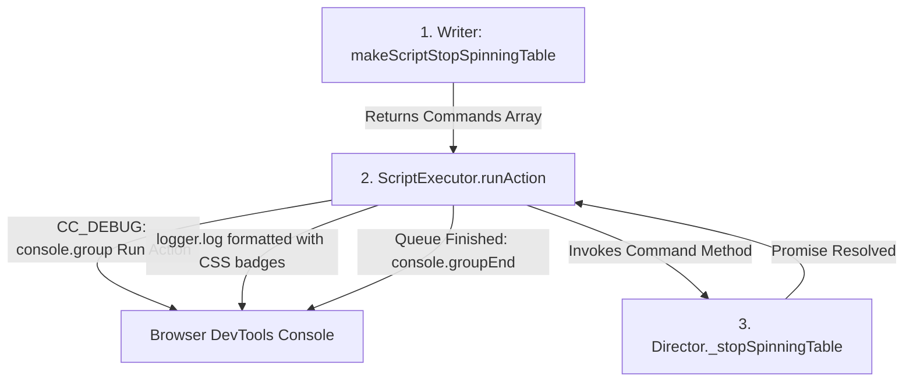

# 🔍 Diagnostic Logging, DevTools Styling & Action Grouping

<!-- convention-summary-start -->
### Diagnostic Logging, DevTools Styling & Action Grouping Summary

- **Core Architecture / Purpose**: Technical reference, API contract, and integration guide for Diagnostic Logging, DevTools Styling & Action Grouping.
- **Key Mechanisms & Design**: Encapsulates core algorithms, event hooks, and performance optimizations within the slot framework runtime.
- **Domain Capabilities**: cc_slot_module, 04_script_execution_pipeline
- **Scope & Code Paths**: `assets/cc-common/cc-slot-module/`
- **Related Docs**: [Master Index](../INDEX.md)
<!-- convention-summary-end -->


---

## 1. How Writer, Director & Logger Interact in `ScriptExecutor`

During slot development and live debugging, the `ScriptExecutor` pipeline integrates directly with the `eno.Logger` diagnostic subsystem and browser DevTools console to trace every action and command step:



---

## 2. Logger Setup & Badge Styling (`setLogger`)

When the mode director initializes `ScriptExecutor`, it injects a logger instance via `setLogger(logger)`:

```typescript
// ScriptExecutor.ts: setLogger implementation
setLogger(logger: eno.Logger): void {
    this.logger = logger;
    this.logger.addFilter(`[${this.name}]`);
    this.logger.setStyles({
        '[Event]':    'color: white; background-color: #6c5ce7; font-weight: bold; font-size: 12px;',
        '[Script]':   'color: white; background-color: #8854d0; font-weight: bold; font-size: 12px;',
        '[Action]':   'color: white; background-color: #8854d0; font-weight: bold; font-size: 12px;',
        '[Skipping]': 'color: white; background-color: #ff6b6b; font-weight: normal; font-size: 12px;',
        '[Running]':  'color: white; background-color: #26de81; font-weight: normal; font-size: 12px;',
        '[Finish]':   'color: white; background-color: #636e72; font-weight: bold; font-size: 12px;'
    });
}
```

### Color Badge Mapping in DevTools Console:
* 🟣 **`[Action]` / `[Script]` (`#8854d0`)**: Indicates the start of a high-level action generated by the `Writer`.
* 🟢 **`[Running]` (`#26de81`)**: Indicates active command execution on the `Director`.
* 🔴 **`[Skipping]` (`#ff6b6b`)**: Indicates fast-stop / Turbo mode skipping active tweens.
* ⚫ **`[Finish]` (`#636e72`)**: Indicates completion of the command queue.

---

## 3. Hierarchical Console Grouping in `runAction()`

In development builds (`CC_DEBUG = true`), `ScriptExecutor.runAction()` wraps the entire command queue inside collapsible `console.group` blocks:

```typescript
// ScriptExecutor.runAction
runAction(actionName: string, data?: any): Promise<void> {
    if (CC_DEBUG) {
        console.group(`Run Action: ${actionName}`);
    }

    return new Promise<void>((resolve, reject) => {
        // Synthesizes script queue from Writer
        const listScripts = this.writer["makeScript" + actionName](data);
        
        // Logs step execution on Director
        this.executeNextScript(actionName);
    });
}
```

When all steps on the Director complete, `console.groupEnd()` is called inside `executeNextScript()`:

```typescript
if (!this.scripts[actionName] || this.scripts[actionName].actions.length === 0) {
    this.onFinishScript(actionName);
    if (CC_DEBUG) {
        console.groupEnd();
    }
    return;
}
```

---

## 4. Error Trapping & Failed Action Diagnostics

If a `Director` method is missing or not declared as a valid function, `ScriptExecutor` emits a formatted error log with full context:

```typescript
if (!this.isValidAction(command)) {
    this.logger.log(`[${this.name}]`, `run command: ${action.command} is not a valid function`);
    cc.error(`[GameView][${this.name}][${actionName}] run command: ${action.command} is not a valid function`);
}
```

This ensures developers can instantly identify whether a defect is caused by a malformed command name in the `Writer` or a missing method implementation on the `Director`.
