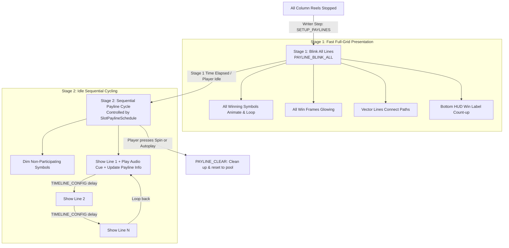

# 🎭 The Two-Stage Win Presentation Lifecycle

<!-- convention-summary-start -->
### The Two-Stage Win Presentation Lifecycle Summary

- **Core Architecture / Purpose**: Technical reference, API contract, and integration guide for The Two-Stage Win Presentation Lifecycle.
- **Key Mechanisms & Design**: Encapsulates core algorithms, event hooks, and performance optimizations within the slot framework runtime.
- **Domain Capabilities**: cc_slot_module, 05_payline_and_win_presentation_system
- **Scope & Code Paths**: `assets/cc-common/cc-slot-module/`
- **Related Docs**: [Master Index](../INDEX.md)
<!-- convention-summary-end -->

---

## 1. Lifecycle Overview

The SDK enforces a distinct **Two-Stage Presentation Lifecycle** for win celebrations, balancing instant user gratification with clear individual win breakdown during idle state.

---

## 2. Deep Breakdown of Stage 1 (Show All Lines)

1. **Trigger Source**: `NormalGameWriterModule.makeScriptShowPayline()` pushes `SETUP_PAYLINES` and `SHOW_PAYLINES` steps to the `ScriptExecutor` queue.
2. **Concurrent Activation**:
   - `SlotTablePaylineModule` emits `PAYLINE_SET_DATA`.
   - `SlotPaylineSchedule` immediately fires `PAYLINE_BLINK_ALL`.
   - `PaylineSymbolModule` fetches all participating win symbol nodes, reparents them to `this.container` (above reel masks), and calls `symbol.emit('PLAY_ANIMATION_WIN')`.
   - `PaylineWinFrameModule` spawns border boxes at all winning coordinates.
   - `PaylineLineModule` renders line vector paths.
3. **Audio & Rolling Win**:
   - Sound triggers total win celebratory voice/SFX.
   - Bottom HUD `WinAmountModule` begins rapid rolling number increment.
4. **Fast-To-Result (FTR)**: If the player taps the screen during Stage 1, FTR immediately terminates the delay and moves into idle cycling or the next spin.

---

## 3. Deep Breakdown of Stage 2 (Sequential Cycling)

1. **Activation**: Initiated by `SlotPaylineSchedule.start()` once the Stage 1 timeout expires.
2. **Single-Line Isolation (`PAYLINE_SHOW_LINE`)**:
   - `PaylineSymbolModule.dimAllPayLines()` darkens all other symbols.
   - Only the symbols in `payLine.winSymbols` stay brightly illuminated and play Spine win loops.
   - `PaylineWinFrameModule` highlights only the frames belonging to the current line.
   - `PaylineNumberModule` illuminates the side line number badge corresponding to the active line.
3. **Step Timer (`TIMELINE_CONFIG`)**:
   - Defined in `PaylineConfig.TIMELINE_CONFIG` (typically $2.0\text{s}$ per line).
   - Ticks sequentially: `Index 0 ➔ Index 1 ➔ ... ➔ Index K-1 ➔ Loop back to 0`.
4. **Interruption & Teardown**:
   - The moment a new spin is requested or the player exits the mode, `PAYLINE_CLEAR` executes, returning all symbols and frame prefabs cleanly to their node pools.
