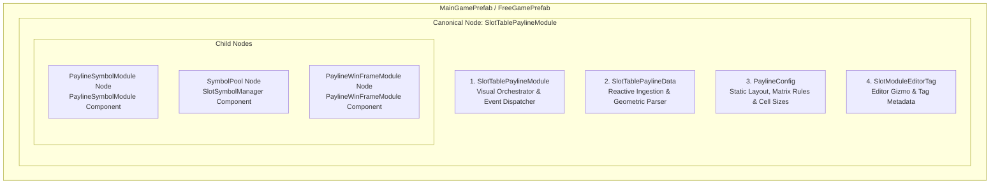

# 🧩 Payline Component Quad & Visual Rendering Layers

<!-- convention-summary-start -->
### Payline Component Quad & Visual Rendering Layers Summary

- **Core Architecture / Purpose**: Technical reference, API contract, and integration guide for Payline Component Quad & Visual Rendering Layers.
- **Key Mechanisms & Design**: Encapsulates core algorithms, event hooks, and performance optimizations within the slot framework runtime.
- **Domain Capabilities**: cc_slot_module, 05_payline_and_win_presentation_system
- **Scope & Code Paths**: `assets/cc-common/cc-slot-module/`
- **Related Docs**: [Master Index](../INDEX.md)
<!-- convention-summary-end -->


---

## 1. The Payline Component Quad (Verified via Cocos MCP Scene Inspection)

Inspected directly from production scenes (`g9000L` / `g9666L`), the Payline subsystem components are organized with extreme cohesion:



| Component | Base Class | Architectural Role |
| :--- | :--- | :--- |
| **`SlotTablePaylineModule`** | `SlotBaseModule` | Master coordinator; creates internal `payLineEmitter` and routes Director events. |
| **`SlotTablePaylineData`** | `BaseDataModule` | Converts raw server strings into `winSymbols` coordinates according to `PAYLINE_TYPE`. |
| **`PaylineConfig`** | `cc.Component` | Declares `PAYLINE_TYPE`, `TABLE_CONFIG`, `cellSize`, and `PAY_LINE_MATRIX`. |
| **`SlotSymbolManager`** | `cc.Component` | Attached to child `SymbolPool` node to provide dedicated, isolated pooling for win symbol animations. |

---

## 2. Real Production Scene Hierarchy

```text
Canvas
└── Director (GameConfig, GameDataStore, GameInit, GameDirector)
    └── GameMode (OnAddGameMode)
        ├── BG_MainG (cc.Sprite)
        ├── BoardG (cc.Sprite)
        └── MainGamePrefab (BaseGameMode, NormalGameDirectorModule, NormalGameWriterModule, OnAddSlotModule)
            ├── SlotTableModule (SlotTableModule, TableModuleConfig, SlotTableData, SlotTableNearWinModule)
            │   ├── SymbolPool (SlotSymbolManager)
            │   ├── Table (cc.Mask - Reel column container)
            │   └── VFX_NearWin (sp.Skeleton)
            └── SlotTablePaylineModule (SlotTablePaylineModule, PaylineConfig, SlotTablePaylineData, SlotModuleEditorTag)
                ├── PaylineSymbolModule (PaylineSymbolModule)
                ├── SymbolPool (SlotSymbolManager)
                └── PaylineWinFrameModule (PaylineWinFrameModule - optional frame layer)
```

---

## 3. Z-Index Management & Mask Clipping Protection

1. **Reparenting Strategy**: When a symbol wins, `eno.changeParent(symbol, this.container)` transfers it to the `Payline` layer which sits above all column mask components (`SlotTableModule/Table`).
2. **Dedicated SymbolPool**: Having a dedicated child `SymbolPool` under `SlotTablePaylineModule` guarantees that win presentation does not starve or corrupt the main spin reel symbol pool.
3. **Safe Return**: On `PAYLINE_CLEAR`, symbols are reparented back to their column parent or returned cleanly to the pool.
