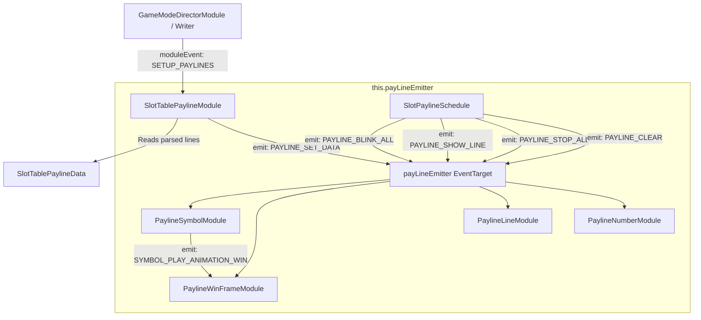

# 📡 Payline Event Bus & Internal Communication Topology

<!-- convention-summary-start -->
### Payline Event Bus & Internal Communication Topology Summary

- **Core Architecture / Purpose**: Technical reference, API contract, and integration guide for Payline Event Bus & Internal Communication Topology.
- **Key Mechanisms & Design**: Encapsulates core algorithms, event hooks, and performance optimizations within the slot framework runtime.
- **Domain Capabilities**: cc_slot_module, 05_payline_and_win_presentation_system
- **Scope & Code Paths**: `assets/cc-common/cc-slot-module/`
- **Related Docs**: [Master Index](../INDEX.md)
<!-- convention-summary-end -->

---

## 1. Internal Event Bus Topology

To prevent polluting the global `eventManager` and scoped `moduleEvent`, the Payline subsystem instantiates a dedicated local event target: **`this.payLineEmitter = new cc.EventTarget()`**.

---

## 2. Event Catalog & Payload Specifications

| Event Name | Emitter | Payload Structure | Purpose |
| :--- | :--- | :--- | :--- |
| **`PAYLINE_SET_DATA`** | `SlotTablePaylineModule` | `{ matrix, payLines, winSymbols, jackpotPayline }` | Ingests parsed winning lines into all visual follower components. |
| **`PAYLINE_BLINK_ALL`** | `SlotPaylineSchedule` | `{ blinkDuration: number }` | Triggers simultaneous Stage 1 win animations across all winning symbols and lines. |
| **`PAYLINE_SHOW_LINE`** | `SlotPaylineSchedule` | `(payLine: PayLineInfo, duration?: number)` | Triggers Stage 2 isolated presentation for a single payline. |
| **`PAYLINE_STOP_ALL`** | `SlotPaylineSchedule` | None | Halts looping win animations and hides border frames before switching lines. |
| **`PAYLINE_DIM_ALL`** | `SlotPaylineSchedule` | `(excludeSymbols: cc.Node[])` | Dims all unhit symbols, keeping only current line symbols bright. |
| **`PAYLINE_CLEAR`** | `SlotPaylineSchedule` / Director | None | Resets all layers, unparenting symbols and returning frame nodes to pool. |
| **`SYMBOL_PLAY_ANIMATION_WIN`** | `PaylineSymbolModule` | `{ symbol, loop, duration }` | Informs `PaylineWinFrameModule` to spawn and sync a border frame around this symbol. |

---

## 3. Communication Safeguards

1. **Scope Encapsulation**: Child visual modules (`PaylineSymbolModule`, `PaylineWinFrameModule`) only listen to `payLineEmitter`, completely decoupling them from the game mode directors.
2. **Context Injection**: During `SlotTablePaylineModule.init()`, the `payLineEmitter` instance is injected into all child `BasePaylineComponent` components via `component.init({ payLineEmitter, config, moduleEvent, eventManager })`.
3. **Memory Safety**: Destroying the `Payline` node automatically garbage collects `payLineEmitter` and all bound listeners without leaving orphaned closures in the engine.
