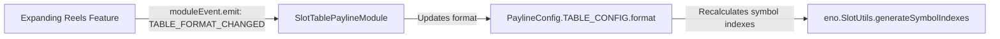

# 🛠️ Custom Payline Rules & Game Creation Workflow

<!-- convention-summary-start -->
### Custom Payline Rules & Game Creation Workflow Summary

- **Core Architecture / Purpose**: Technical reference, API contract, and integration guide for Custom Payline Rules & Game Creation Workflow.
- **Key Mechanisms & Design**: Encapsulates core algorithms, event hooks, and performance optimizations within the slot framework runtime.
- **Domain Capabilities**: cc_slot_module, 05_payline_and_win_presentation_system
- **Scope & Code Paths**: `assets/cc-common/cc-slot-module/`
- **Related Docs**: [Master Index](../INDEX.md)
<!-- convention-summary-end -->


---

## 1. Developer Setup Checklist for New Slot Games

Follow this checklist when integrating the Payline subsystem into a new slot title:

### Step 1: Create Hierarchy Nodes in `BoardG`
1. Create a child Node named `Payline` inside `BoardG`.
2. Attach:
   - `SlotTablePaylineModule`
   - `SlotTablePaylineData`
   - `PaylineConfig`
   - `SlotPaylineSchedule`
3. Create child layers under `Payline`:
   - `WinSymbolsLayer` ➔ Attach `PaylineSymbolModule`
   - `WinFramesLayer` ➔ Attach `PaylineWinFrameModule`
   - `LineDrawingLayer` ➔ Attach `PaylineLineModule`
   - `LineNumberLayer` ➔ Attach `PaylineNumberModule`

### Step 2: Configure `PaylineConfig`
```typescript
@ccclass
export class MyGamePaylineConfig extends PaylineConfig {
    // 1. Choose Pay Type
    public readonly PAYLINE_TYPE: PAYLINE_TYPE = PAYLINE_TYPE.AllWays;

    // 2. Set Grid Geometry
    public readonly TABLE_CONFIG: any = {
        format: [3, 3, 3, 3, 3],
        cellSize: new cc.Vec2(180, 160),
    };

    // 3. Set Step Timer Interval (seconds per line during Stage 2 idle)
    public readonly TIMELINE_CONFIG: number = 2.0;

    // 4. Set Wild Codes for win evaluations
    public readonly WILD_CODE_CONFIG: string[] = ["WILD", "WILD_2X"];
}
```

### Step 3: Register in Mode Director
In your `GameModeDirectorModule` (or Normal/Free Directors), add the `Payline` node to the `moduleList` property so `setupModule()` properly binds `moduleEvent`.

---

## 2. Handling Dynamic Grid Formats & Expanding Reels

If your game expands columns during Free Spins (e.g. 5x3 expanding to 5x4 or 3-4-4-4-3):



When the grid changes:
```typescript
// Inside ExpandingReelsModule.ts
this.moduleEvent.emit("TABLE_FORMAT_CHANGED", {
    tableFormat: [3, 4, 4, 4, 3]
});
```
`SlotTablePaylineModule.onTableFormatChanged()` automatically updates `PaylineConfig.TABLE_CONFIG.format`, ensuring all coordinate math in `PaylineUtils` instantly aligns with the expanded rows.

---

## 3. Production Case Study: 243 AllWays with Wild Multiplier Frame

In Red Cliff (`g9666L`):
1. **Payline Type**: `PAYLINE_TYPE.AllWays` (243 Ways).
2. **Wild Multipliers**: When a winning combination contains a Wild symbol ("K"), a custom subclass of `PaylineSymbolModule` reads `line.multiplier` and triggers a flaming multiplier box above the Wild cell.
3. **Smooth Cleanups**: Subscribed to `PAYLINE_CLEAR` to ensure all custom particle systems and multiplier labels reset before the next spin roll.
