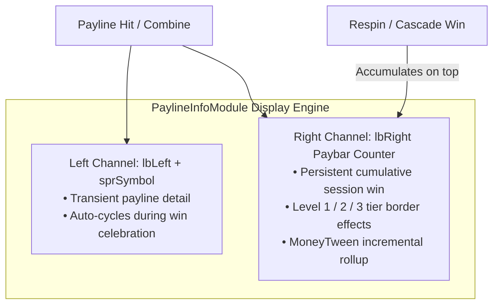

# 🏆 Paybar HUD Persistence, Multi-Tier Effects & Free Game Win Rollup

<!-- convention-summary-start -->
### Paybar HUD Persistence, Multi-Tier Effects & Free Game Win Rollup Summary

- **Core Architecture / Purpose**: Technical reference, API contract, and integration guide for Paybar HUD Persistence, Multi-Tier Effects & Free Game Win Rollup.
- **Key Mechanisms & Design**: Encapsulates core algorithms, event hooks, and performance optimizations within the slot framework runtime.
- **Domain Capabilities**: cc_slot_module, 05_payline_and_win_presentation_system
- **Scope & Code Paths**: `assets/cc-common/cc-slot-module/`
- **Related Docs**: [Master Index](../INDEX.md)
<!-- convention-summary-end -->


---

## 1. Architectural Role of Paybar HUD

The Paybar HUD (`PaylineInfoModule` / `PaylineInfoModule9666`) is the primary win feedback panel positioned at the bottom of the slot matrix.

It operates across two coordinated display channels:
1. **Left Label (`lbLeft`) & Sprite (`sprSymbol`)**: Payline context indicator (e.g. `Line 5 10x [Symbol_K]`).
2. **Right Label (`lbRight`)**: Real-time cumulative win amount counter running animations and MoneyTween count-ups.



---

## 2. Multi-Tier Win Effects Coordination

When a win value updates on the Paybar, the system dispatches:
```typescript
this.eventManager.emit('SHOW_TOTAL_WIN_EFFECT', { winAmount: totalWinSoFar, totalBet });
this.eventManager.emit('PLAY_WIN_PANEL_WIN_EFFECT');
```

The Win Panel background shifts dynamic visual tiers based on $\text{winRatio} = \frac{\text{winAmount}}{\text{totalBet}}$:
* **Tier 1 (Base Win, $< 5\times \text{Bet}$)**: Subtle gold glow & punchy scale bounce.
* **Tier 2 (Medium Win, $5\times - 20\times \text{Bet}$)**: Dynamic animated particle flare & frame pulse.
* **Tier 3 (Big/Mega/Epic Win, $> 20\times \text{Bet}$)**: Full cinematic Spine celebration trigger (`BigWinCutscene`).

---

## 3. Persistent HUD in Free Game Cascades

During Free Game sessions with cascading multipliers:
1. When Multipliers trigger via `APPLY_MULTIPLIER_TO_WIN_AMOUNT`, the HSN combine Spine animation plays, scaling the intermediate win amount.
2. Once the multiplier completes, the right label (`lbRight`) animates to the new cumulative `winAmountPS`.
3. The Paybar remains on screen throughout the entire Free Game sequence without flickering or resetting to zero between consecutive Free Spins.
