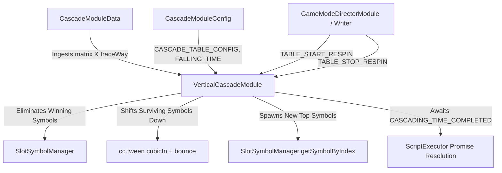

# 🌊 Cascade & Avalanche Subsystem Architecture Master Guide

<!-- convention-summary-start -->
### Cascade & Avalanche Subsystem Architecture Master Guide Summary

- **Core Architecture / Purpose**: Technical reference, API contract, and integration guide for Cascade & Avalanche Subsystem Architecture Master Guide.
- **Key Mechanisms & Design**: Encapsulates core algorithms, event hooks, and performance optimizations within the slot framework runtime.
- **Domain Capabilities**: cc_slot_module, 06_cascade_and_avalanche_system
- **Scope & Code Paths**: `./01_cascade_lifecycle_and_respin_flow.md`, `./02_matrix_elimination_and_drop_physics.md`, `./03_mega_symbols_and_variable_height_grids.md`
- **Related Docs**: [`01_cascade_lifecycle_and_respin_flow`](./01_cascade_lifecycle_and_respin_flow.md), [`02_matrix_elimination_and_drop_physics`](./02_matrix_elimination_and_drop_physics.md), [`03_mega_symbols_and_variable_height_grids`](./03_mega_symbols_and_variable_height_grids.md)
<!-- convention-summary-end -->

---

## 1. Subsystem Architectural Mission

The **Cascade & Avalanche Subsystem** drives cascading/tumbling reel games (e.g. Candy Bonanza, Mahjong Ways, Greek Gods). When winning paylines or clusters hit, the winning symbols are eliminated (`DROP_SYMBOL_CODE = '-1'`), surviving symbols tumble downward with gravity and bounce easing, and fresh new symbols cascade in from above the visible viewport to complete subsequent respin evaluation rounds.

---

## 2. Core Architectural Principles

1. **Deterministic Elimination Mapping (`traceWay`)**:
   - Winning coordinate indexes are delivered as a flat integer array `traceWay: number[]` (e.g. `[1, 3, 7, 8]`). `CascadeModuleData` transforms this into a 2D matrix marked with `DROP_SYMBOL_CODE = '-1'`.
2. **Variable-Height & Mega-Symbol Physics**:
   - Symbols with height $> 1$ (e.g. `A_1_2` = symbol A with height 2 cells) calculate correct bottom-anchored drop distances and adjust sibling indexes dynamically.
3. **Gravity Easing & Bounce Curves**:
   - Drops accelerate with `cubicIn` curve towards `targetPos`, overshoot slightly to `targetBouncePos` ($+10\text{px}$ delta), and settle cleanly at target coordinate.
4. **Turbo / Fast-to-Result (FTR) Adaptability**:
   - Automatically queries `this.gameSettings.isTurboActive` to halve drop times (`FALLING_TIME: 0.2s` vs `0.4s`) and compress bounce durations.

---

## 3. Subsystem Chapter Index

| Chapter | Topic | Key Focus Area |
| :--- | :--- | :--- |
| **[`01_cascade_lifecycle_and_respin_flow`](./01_cascade_lifecycle_and_respin_flow.md)** | Lifecycle & Respin Loop | Complete sequence from initial spin stop to cascade loop iterations. |
| **[`02_matrix_elimination_and_drop_physics`](./02_matrix_elimination_and_drop_physics.md)** | Elimination & Drop Physics | Mathematics of column shifting, top buffer spawning, and tween curves. |
| **[`03_mega_symbols_and_variable_height_grids`](./03_mega_symbols_and_variable_height_grids.md)** | Mega Symbols & Variable Grids | Handling irregular row heights `format: [3, 4, 5, 4, 3]` and multi-cell spans. |
| **[`04_cascade_event_bus_and_writer_integration`](./04_cascade_event_bus_and_writer_integration.md)** | Event Bus & Writer Pipeline | `TABLE_START_RESPIN`, `TABLE_STOP_RESPIN`, and `ScriptExecutor` Promise handling. |
| **[`05_custom_cascade_game_creation`](./05_custom_cascade_game_creation.md)** | Game Creation Guide | Step-by-step setup guide for building a new cascading slot game. |
| **[`06_symbol_manager_table_and_indexing_integration`](./06_symbol_manager_table_and_indexing_integration.md)** | Symbol Pool, Table & Indexing | Deep-dive into `SlotSymbolModule`, `SymbolOwnerType.CASCADE_SYMBOL`, Table handover, and `setIndex()` coordinate mapping. |
