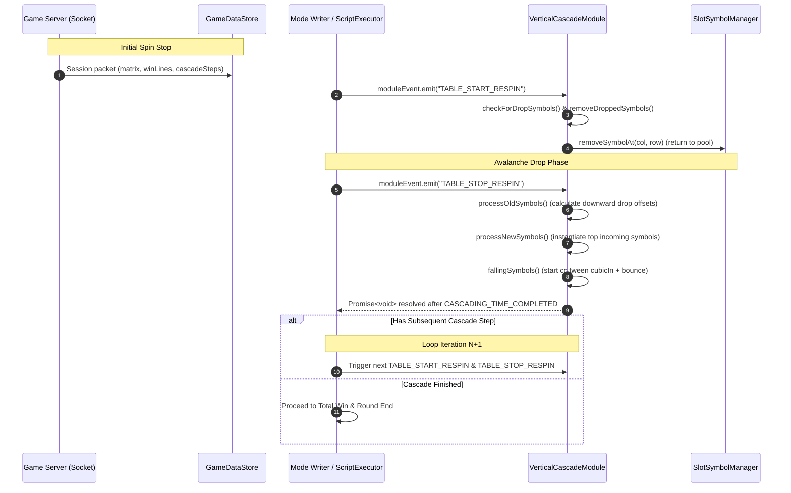

# 🔄 Cascade Lifecycle & Respin Loop Sequencing

<!-- convention-summary-start -->
### Cascade Lifecycle & Respin Loop Sequencing Summary

- **Core Architecture / Purpose**: Technical reference, API contract, and integration guide for Cascade Lifecycle & Respin Loop Sequencing.
- **Key Mechanisms & Design**: Encapsulates core algorithms, event hooks, and performance optimizations within the slot framework runtime.
- **Domain Capabilities**: cc_slot_module, 06_cascade_and_avalanche_system
- **Scope & Code Paths**: `assets/cc-common/cc-slot-module/`
- **Related Docs**: [Master Index](../INDEX.md)
<!-- convention-summary-end -->

---

## 1. End-to-End Cascade Sequence Flowchart

---

## 2. Phase Breakdown

1. **Step 1 - Hit Identification & Elimination (`TABLE_START_RESPIN`)**:
   - Compares current table matrix with `traceWay` winning coordinates.
   - Dispatches visual explosion/disappearing effects on winning symbols and returns their nodes to `SlotSymbolManager`.
2. **Step 2 - Gravity Calculation & Spawning (`TABLE_STOP_RESPIN`)**:
   - Shifts surviving symbols downward based on empty slot counts beneath them.
   - Spawns fresh top symbols positioned offscreen above column headers (`firstPosition.y + delta`).
3. **Step 3 - Physical Tumble & Settling**:
   - Executes `cc.tween` with `cubicIn` acceleration.
   - Triggers `PLAY_ANIMATION_APPEAR` upon reaching landing coordinate.
   - Bounces upwards by $10\text{px}$ (`targetBouncePos`) before settling cleanly.
