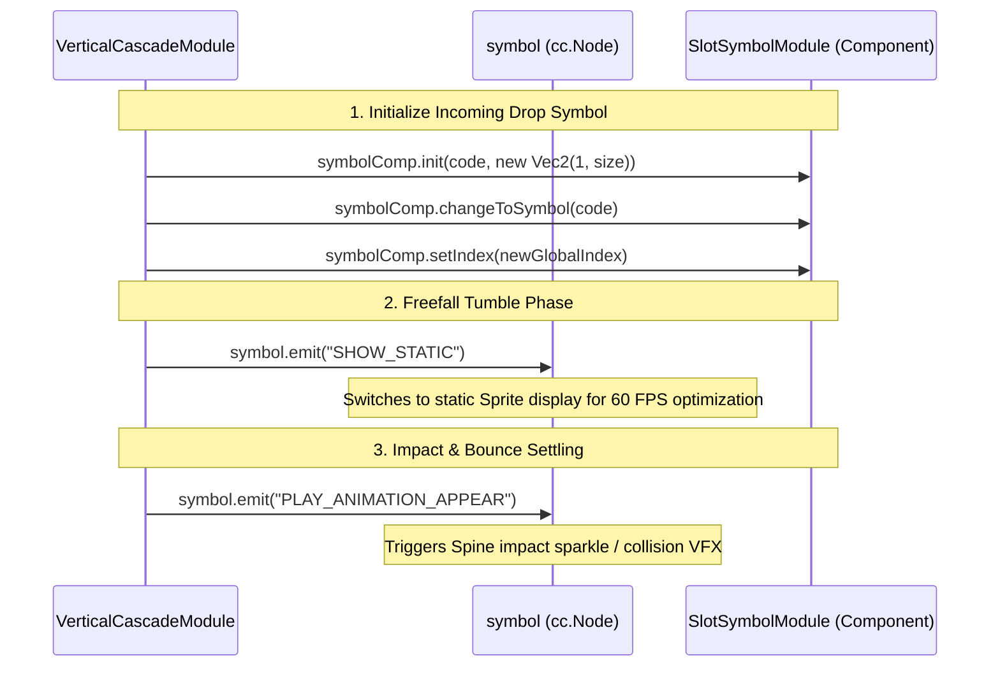

# 🧩 SlotSymbolModule, Shared Pool & Symbol Indexing Architecture in Cascade

<!-- convention-summary-start -->
### SlotSymbolModule, Shared Pool & Symbol Indexing Architecture in Cascade Summary

- **Core Architecture / Purpose**: Technical reference, API contract, and integration guide for SlotSymbolModule, Shared Pool & Symbol Indexing Architecture in Cascade.
- **Key Mechanisms & Design**: Encapsulates core algorithms, event hooks, and performance optimizations within the slot framework runtime.
- **Domain Capabilities**: cc_slot_module, 06_cascade_and_avalanche_system
- **Scope & Code Paths**: `assets/cc-common/cc-slot-module/`
- **Related Docs**: [Master Index](../INDEX.md)
<!-- convention-summary-end -->


---

## 1. Shared Node Pool Architecture via `SlotSymbolManager`

In the Cocos Slot Framework SDK, **`SlotSymbolManager`** is the single centralized source of truth for symbol allocation and pooling (Single Source of Truth for Symbols). `VerticalCascadeModule` does not instantiate separate standalone node pools; instead, it coordinates directly with `SlotSymbolManager` using the dedicated ownership domain **`SymbolOwnerType.CASCADE_SYMBOL`**.

```mermaid
graph TD
    SM[SlotSymbolManager Node Pool] -->|SymbolOwnerType.TABLE_SYMBOL| Table[SlotTableModule / SlotReelModule]
    SM -->|SymbolOwnerType.CASCADE_SYMBOL| Cascade[VerticalCascadeModule container]
    SM -->|SymbolOwnerType.PAYLINE_SYMBOL| Payline[PaylineSymbolModule]
    
    Cascade -->|1. getSymbolByIndex(index, CASCADE_SYMBOL)| SM
    Cascade -->|2. removeSymbol(symbol) / returnSymbol(symbol)| SM
    Cascade -->|3. updateSymbolSiblingIndex(flattenSymbols)| SM
```

### Symbol Borrowing and Recycling Lifecycle:
1. **Retrieve Node by Existing Position**:
   ```typescript
   const symbol = this.symbolManager.getSymbolByIndex(index, SymbolOwnerType.CASCADE_SYMBOL);
   ```
2. **Retrieve Fresh Node for Top Influx Inflow**:
   ```typescript
   const symbol = this.symbolManager.getSymbolByIndex(SymbolIndexType.UNUSED, SymbolOwnerType.CASCADE_SYMBOL);
   ```
3. **Recycle Winning Eliminated Tile**:
   ```typescript
   this.symbolManager.removeSymbol(symbol);
   symbol.parent = null;
   ```
4. **Clean Teardown Upon Cascade Completion**:
   ```typescript
   this.symbolManager.returnSymbol(symbol);
   ```

---

## 2. Direct Interaction with `SlotSymbolModule` Component

Every pooled symbol node is wrapped by the **`SlotSymbolModule`** (or `MultipleSlotSymbolModule`) component. `VerticalCascadeModule` coordinates visual presentation by directly dispatching commands and events to `SlotSymbolModule`:



---

## 3. Interaction with Table Engine (`SlotTableModule`) & Ownership Handover

### A. Display Ownership Handover
* **Base Spin Phase**: `SlotTableModule` and its child `SlotReelModule` instances manage base rolling and initial spin stop display.
* **Cascade Respin Phase**:
  1. `SlotTableModule` holds state or transfers active matrix ownership to `VerticalCascadeModule`.
  2. `VerticalCascadeModule` renders active falling tiles inside `this.container` (positioned above or substituting reel tiles).
  3. `VerticalCascadeModule` assumes exclusive control of elimination, drop trajectories, and bounce physics.

### B. Interrupt Recovery Mechanics (`resetAllEffectAndTasks`)
If a player triggers Turbo / Fast Stop or reconnects during an in-flight tumble:
* `resetAllEffectAndTasks()` parses `this.matrix` and immediately reconstructs visual symbol nodes at their exact static landing coordinates:
  ```typescript
  const symbolComp = SlotSymbolModule.getModuleComponent(symbol);
  symbolComp.init(symbolValue);
  symbolComp.changeToSymbol(symbolValue);
  symbol.setPosition(position);
  ```

---

## 4. Coordinate Indexing & Dynamic Re-Indexing Math (`SYMBOL_INDEXES`)

### A. Matrix Index Generation via `SlotUtils.generateSymbolIndexes()`
In `CascadeModuleConfig`:
```typescript
public get SYMBOL_INDEXES(): number[][] {
    if (this._symbolIndexes === null) {
        this._symbolIndexes = eno.SlotUtils.generateSymbolIndexes(this.CASCADE_TABLE_CONFIG.format);
    }
    return this._symbolIndexes;
}
```

For a standard $5 \times 3$ matrix (`format: [3, 3, 3, 3, 3]`):
$$\begin{bmatrix}
(0,0)=0 & (1,0)=3 & (2,0)=6 & (3,0)=9 & (4,0)=12 \\
(0,1)=1 & (1,1)=4 & (2,1)=7 & (3,1)=10 & (4,1)=13 \\
(0,2)=2 & (1,2)=5 & (2,2)=8 & (3,2)=11 & (4,2)=14
\end{bmatrix}$$

### B. Critical Mandate: Updating `setIndex` During Symbol Downward Shifts
When a surviving symbol drops from an upper row $i$ down to empty lower row $currentIndex$:
```typescript
// Excerpt from VerticalCascadeModule.getOldSymbols(col):
this.swapSymbol(col, currentIndex, i);
SlotSymbolModule.getModuleComponent(symbol).setIndex(this.getSymbolIndex(col, currentIndex));
```

> [!CRITICAL]
> **WHY `setIndex` UPDATE IS MANDATORY:**
> Subsequent evaluation subsystems (`SlotTablePaylineModule`, `PaylineWinFrameModule`, and `PaylineSymbolModule`) locate winning coordinates using global indices ($0 \dots 14$) received from server packets (e.g. payline winning cells `[0, 4, 8]`).
> If `VerticalCascadeModule` fails to invoke `setIndex(newIndex)` on dropped symbol nodes, the symbols retain their previous row indexes. This leads to **misaligned Win Frames, incorrect win line cycling, and Spine celebration animations rendering on the wrong cells!**
