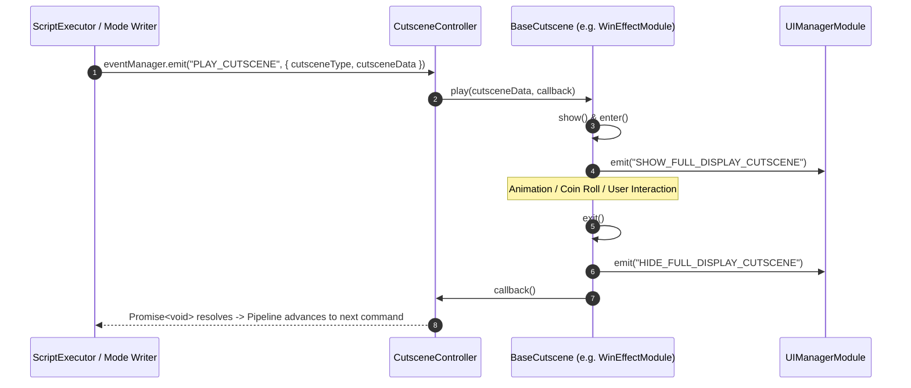

# 🎬 Cutscene Queue, Registration & Promise Chaining Orchestration

<!-- convention-summary-start -->
### Cutscene Queue, Registration & Promise Chaining Orchestration Summary

- **Core Architecture / Purpose**: Technical reference, API contract, and integration guide for Cutscene Queue, Registration & Promise Chaining Orchestration.
- **Key Mechanisms & Design**: Encapsulates core algorithms, event hooks, and performance optimizations within the slot framework runtime.
- **Domain Capabilities**: cc_slot_module, 07_cutscenes_and_celebration_system
- **Scope & Code Paths**: `assets/cc-common/cc-slot-module/`
- **Related Docs**: [Master Index](../INDEX.md)
<!-- convention-summary-end -->


---

## 1. Registration & Map Hydration (`makeCutSceneList`)

During `onLoadExtend()`, `CutsceneController` activates all child nodes and discovers all attached `BaseCutscene` components:

```typescript
makeCutSceneList(): void {
    this.cutScenes.clear();
    const cutSceneModes = this.node.getComponentsInChildren(BaseCutscene);
    cutSceneModes.forEach(cutSceneMode => {
        if (cutSceneMode) {
            cutSceneMode.init();
            this.cutScenes.set(cutSceneMode.cutsceneType, cutSceneMode);
        }
    });
}
```

---

## 2. Asynchronous Promise Chaining Pipeline

When a writer command executes `PLAY_CUTSCENE`:


