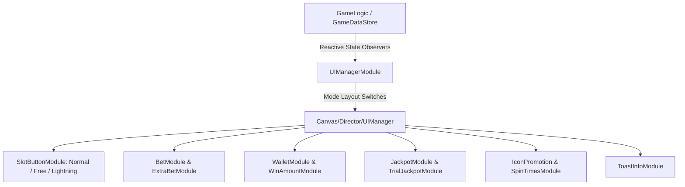

# 🎛️ GUI Dashboard, Controls & Betting System Architecture Index

<!-- convention-summary-start -->
### GUI Dashboard, Controls & Betting System Architecture Index Summary

- **Core Architecture / Purpose**: Technical reference, API contract, and integration guide for GUI Dashboard, Controls & Betting System Architecture Index.
- **Key Mechanisms & Design**: Encapsulates core algorithms, event hooks, and performance optimizations within the slot framework runtime.
- **Domain Capabilities**: cc_slot_module, 08_gui_dashboard_and_controls_system
- **Scope & Code Paths**: `./01_ui_manager_and_hud_orchestration.md`, `./02_spin_button_state_machine_and_modes.md`, `./03_betting_matrix_and_denominations.md`
- **Related Docs**: [`01_ui_manager_and_hud_orchestration.md`](./01_ui_manager_and_hud_orchestration.md), [`02_spin_button_state_machine_and_modes.md`](./02_spin_button_state_machine_and_modes.md), [`03_betting_matrix_and_denominations.md`](./03_betting_matrix_and_denominations.md)
<!-- convention-summary-end -->

---

## 1. Subsystem Mission

The **GUI Dashboard, Controls & Betting Subsystem** delivers player interaction controls, currency state synchronization, bet sizing configuration, and contextual HUD presentation across all game modes (`NORMAL_GAME`, `FREE_GAME`, `BONUS_GAME`).

---

## 2. Topic Breakdown & Navigation

1. **[`01_ui_manager_and_hud_orchestration.md`](./01_ui_manager_and_hud_orchestration.md)**
   - Master layout orchestrator (`UIManagerModule`), mode UI transitions, and cutscene/popup input blocking.
2. **[`02_spin_button_state_machine_and_modes.md`](./02_spin_button_state_machine_and_modes.md)**
   - Spin button class hierarchy, state machine (`NORMAL`, `HOVER`, `SPINNING`), hold-to-auto ($0.7\text{s}$), and Space key routing.
3. **[`03_betting_matrix_and_denominations.md`](./03_betting_matrix_and_denominations.md)**
   - Bet multipliers, coin denominations (`DenomLabel`), total bet calculations, and Ante-Bet toggles (`ExtraBetModule`).
4. **[`04_wallet_and_rolling_money_tweening.md`](./04_wallet_and_rolling_money_tweening.md)**
   - Balance persistence, trial vs real wallet isolation, and animated rolling count-ups (`MoneyTween`).
5. **[`05_trial_mode_promotions_and_notifications.md`](./05_trial_mode_promotions_and_notifications.md)**
   - Demo mode simulation (`TrialModeManager`), promotional free spin badges (`IconPromotion`), and transient alert banners (`ToastInfoModule`).
6. **[`06_custom_gui_dashboard_creation_guide.md`](./06_custom_gui_dashboard_creation_guide.md)**
   - Step-by-step developer guide to assembling custom desktop and portrait HUD panels.
