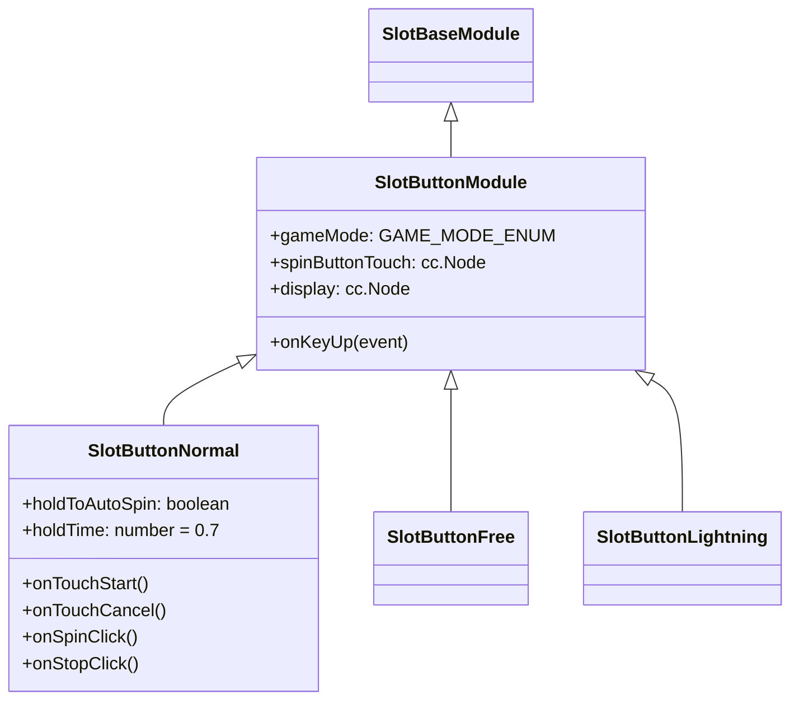
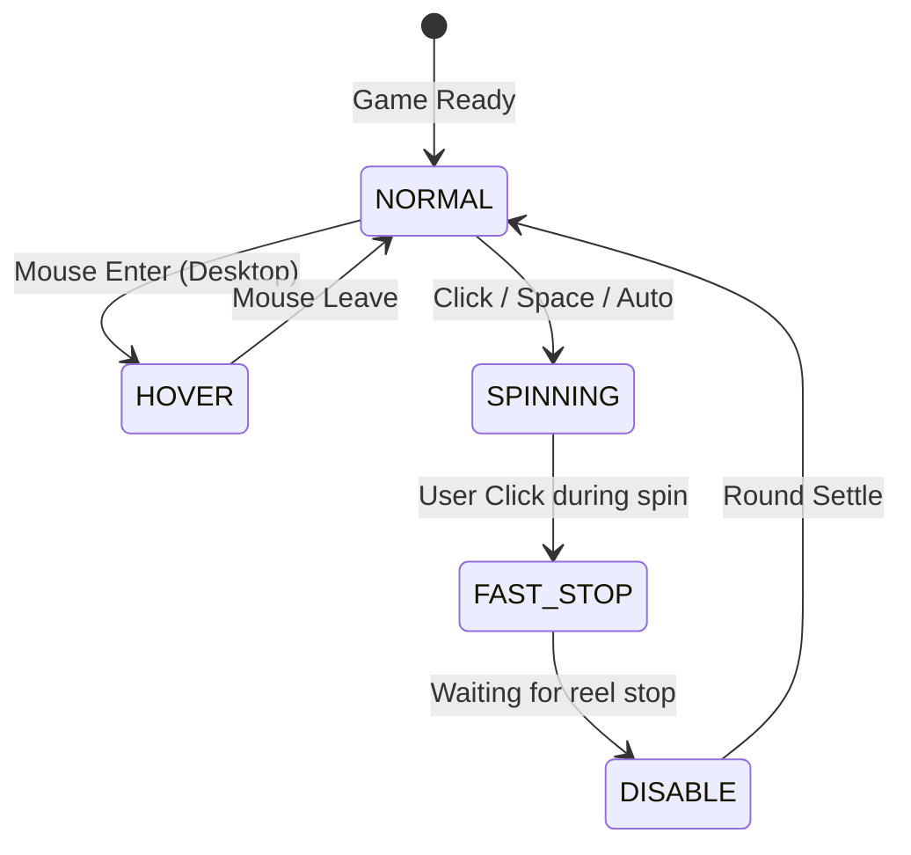

# 🔘 Spin Button State Machine, Touch Gestures & Mode Specialization

<!-- convention-summary-start -->
### Spin Button State Machine, Touch Gestures & Mode Specialization Summary

- **Core Architecture / Purpose**: Technical reference, API contract, and integration guide for Spin Button State Machine, Touch Gestures & Mode Specialization.
- **Key Mechanisms & Design**: Encapsulates core algorithms, event hooks, and performance optimizations within the slot framework runtime.
- **Domain Capabilities**: cc_slot_module, 08_gui_dashboard_and_controls_system
- **Scope & Code Paths**: `SlotButtonNormal.ts`
- **Related Docs**: [Master Index](../INDEX.md)
<!-- convention-summary-end -->

---

## 1. Class Hierarchy

---

## 2. Finite State Machine (FSM)

The spin button switches visual states driven by `buttonModel.state` (`SPIN_BUTTON_STATE_ENUM`):

---

## 3. Hold-to-Auto Gesture ($0.7\text{s}$)

In `SlotButtonNormal.ts`:
- **`TOUCH_START`**: Schedules `holdAction` to fire after `holdTime` ($0.7\text{s}$).
- **`TOUCH_END` / `TOUCH_CANCEL`**: If the finger is released before $0.7\text{s}$, the schedule is cancelled and a normal `NORMAL_SPIN_CLICKED` spin fires.
- If $0.7\text{s}$ elapses, `START_AUTO_SPIN` emits and `isHold = true` suppresses the click release action.
