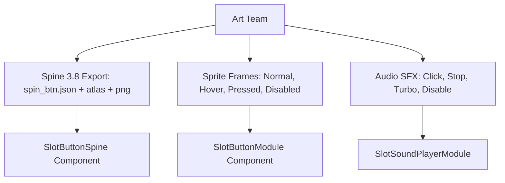

# 🔘 Spin Button Asset Specifications & Spine 3.8 Animation Pipeline

<!-- convention-summary-start -->
### Spin Button Asset Specifications & Spine 3.8 Animation Pipeline Summary

- **Core Architecture / Purpose**: Technical reference, API contract, and integration guide for Spin Button Asset Specifications & Spine 3.8 Animation Pipeline.
- **Key Mechanisms & Design**: Encapsulates core algorithms, event hooks, and performance optimizations within the slot framework runtime.
- **Domain Capabilities**: cc_slot_module, 08_gui_dashboard_and_controls_system
- **Scope & Code Paths**: `assets/cc-common/cc-slot-module/`
- **Related Docs**: [Master Index](../INDEX.md)
<!-- convention-summary-end -->

---

## 1. Architectural Role & Spin Button Modality

The Spin Button is the central interactive hub of any slot game. It operates across multiple modes (Normal Spin, Auto Spin, Turbo Spin, Quick-Stop) and is implemented either via **Spine 3.8 skeletal animation** (`SlotButtonSpine`) or **multi-state Sprite frames** (`cc.Button` / `SlotButtonModule`).

---

## 2. Spine 3.8 Animation Specifications (`SlotButtonSpine`)

When implementing the Spin Button with Spine:

### A. Technical Export Standards
- **Spine Version**: **Spine 3.8**.
- **Texture Compression**: Premultiplied Alpha (PMA).
- **Origin / Root Bone**: Center $(0, 0)$ aligned to the center circle of the button.

### B. Standardized Animation State Names

`SlotButtonSpine` requires the following standard animation track names:

| Animation Name | Loop / Once | Mode / Condition | Description |
| :--- | :--- | :--- | :--- |
| **`normal_idle`** / **`idle`** | Loop | Normal Game Idle | Subtle pulsing or breathing idle loop inviting player touch. |
| **`normal_hover`** / **`hover`** | Loop | Pointer Hover (Desktop/Web) | Glow brightening and slight scaling on mouse-over. |
| **`normal_press`** / **`pressed`** | Once | Touch Down | Instant inward compression click feedback. |
| **`normal_disable`** / **`disable`** | Loop / Static | Reel Spinning / Blocked | Darkened, desaturated locked state. |
| **`auto_spin`** / **`auto`** | Loop | Auto-Spin Mode Active | Continuous rotating halo ring or pulsing arrows around the button. |
| **`stop`** / **`fast_stop`** | Loop | Active Reel Rolling | Square stop icon indicating fast-stop clickability. |
| **`turbo_active`** / **`turbo_idle`** | Loop | Turbo Mode Active | Lightning bolts, fire aura, or accelerated glow pulses. |
| **`lightning_active`** | Loop | Lightning / Instant Mode | Electric arc sparks wrapping around the button border. |

---

## 3. Sprite Frame Specifications (Sprite Mode)

For non-Spine 2D UI button implementations, `SlotButtonModule` requires a 4-state SpriteFrame matrix per mode:

| State | Sprite Frame Description |
| :--- | :--- |
| **Normal** | Default bright button graphic. |
| **Hover** | Highlighted state with outer glow ring ($+15\%$ brightness). |
| **Pressed** | Shifted down-right $2\text{px}$ with inner shadow for tactile click feel. |
| **Disabled** | Grayscale or $50\%$ opacity graphic. |

---

## 4. Audio Sound Effect (SFX) Specifications

| Sound Identifier | File Name | Typical Duration | Frequency Profile | Description |
| :--- | :--- | :--- | :--- | :--- |
| **`sfx_spin_click`** | `spin_btn_click.mp3` | $0.15\text{s} - 0.25\text{s}$ | Crisp, mechanical high-mid click ($1\text{kHz} - 4\text{kHz}$) | Primary button press sound. |
| **`sfx_spin_stop`** | `spin_btn_stop.mp3` | $0.15\text{s} - 0.2\text{s}$ | Heavy metallic latch / brake | Played when clicking Fast-Stop during an active roll. |
| **`sfx_turbo_toggle`**| `turbo_activate.mp3` | $0.3\text{s} - 0.5\text{s}$ | Rising electric whoosh / chime | Played when toggling Turbo/Quick-Spin on. |
| **`sfx_button_disable`**| `button_error.mp3` | $0.1\text{s} - 0.2\text{s}$ | Dull, low-frequency thud ($200\text{Hz}$) | Played when clicking while balance is insufficient or spin is locked. |

---

## 5. Visual Hierarchy & Particle VFX Requirements

1. **Z-Index Layering**: Spin button Spine must be placed under `Canvas/Director/UIManager/SpinButton`, above the bottom dashboard panel background but below full-screen cutscenes and popups.
2. **Particle Effects**: Particle burst nodes (click ripples, stars) should be child nodes configured with `Play On Load = false` and triggered programmatically on `SPIN_CLICKED`.
