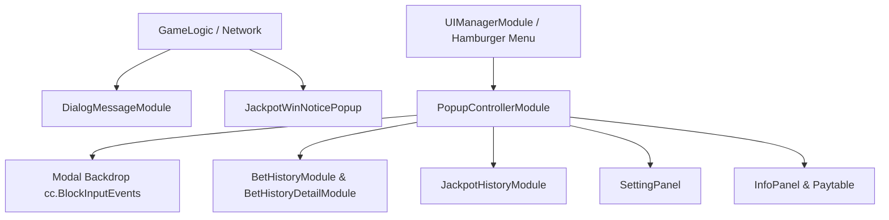

# 📜 Popups, History, Settings & Dialogs System Architecture Index

<!-- convention-summary-start -->
### Popups, History, Settings & Dialogs System Architecture Index Summary

- **Core Architecture / Purpose**: Technical reference, API contract, and integration guide for Popups, History, Settings & Dialogs System Architecture Index.
- **Key Mechanisms & Design**: Encapsulates core algorithms, event hooks, and performance optimizations within the slot framework runtime.
- **Domain Capabilities**: cc_slot_module, 09_popups_history_settings_system
- **Scope & Code Paths**: `./01_modal_queue_and_popup_controller.md`, `./02_bet_and_jackpot_history_subsystem.md`, `./03_settings_and_paytable_info_panels.md`
- **Related Docs**: [`01_modal_queue_and_popup_controller.md`](./01_modal_queue_and_popup_controller.md), [`02_bet_and_jackpot_history_subsystem.md`](./02_bet_and_jackpot_history_subsystem.md), [`03_settings_and_paytable_info_panels.md`](./03_settings_and_paytable_info_panels.md)
<!-- convention-summary-end -->

---

## 1. Subsystem Mission

The **Popups, History, Settings & Dialogs Subsystem** manages modal presentation, background dimming, touch isolation, multi-page paytable rulebooks, granular bet history round reconstruction, user audio/visual settings, and critical network alert dialogs.

---

## 2. Topic Breakdown & Navigation

1. **[`01_modal_queue_and_popup_controller.md`](./01_modal_queue_and_popup_controller.md)**
   - Modal management via `PopupControllerModule`, `BaseUIPopup` base class, show/hide easing animations, and modal stack queueing.
2. **[`02_bet_and_jackpot_history_subsystem.md`](./02_bet_and_jackpot_history_subsystem.md)**
   - Paginated spin history lists, matrix snapshot parsing, payout breakdowns, and recent jackpot winner displays.
3. **[`03_settings_and_paytable_info_panels.md`](./03_settings_and_paytable_info_panels.md)**
   - Volume sliders, Turbo switches, language selectors, multi-page `PageViewIndicator` paytable rulebooks with dynamic bet scaling.
4. **[`04_system_dialogs_and_network_modals.md`](./04_system_dialogs_and_network_modals.md)**
   - System error dialogs (`DialogMessageModule`), confirmation action dispatching (`ON_ACTION_OK`), and global jackpot win broadcast dialogs.
