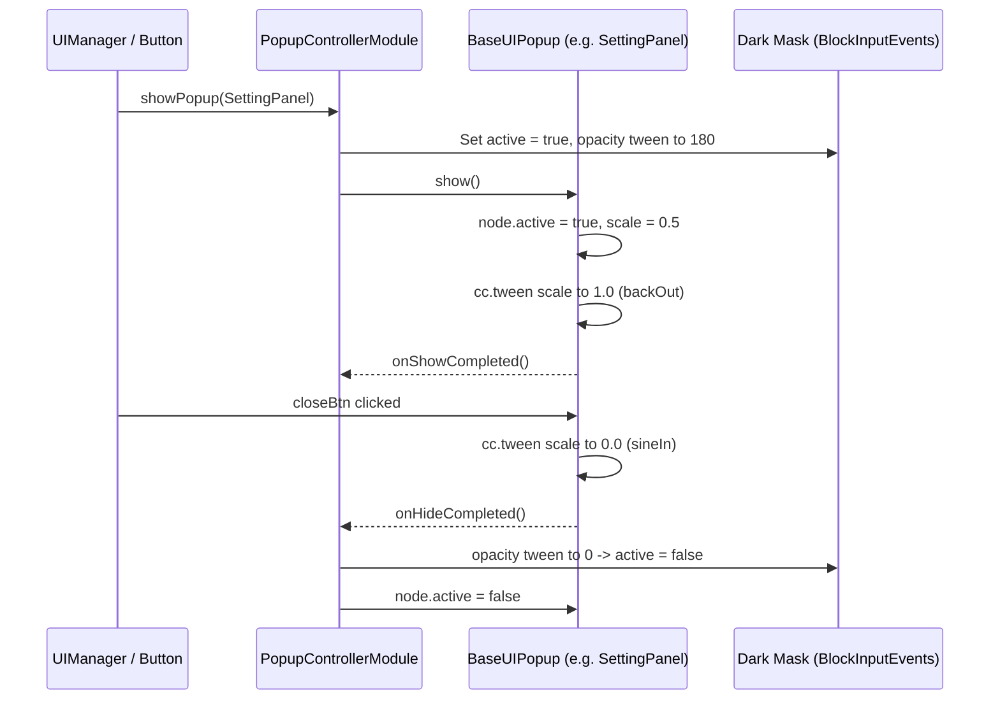

# 🪟 Modal Queue & Popup Controller Architecture

<!-- convention-summary-start -->
### Modal Queue & Popup Controller Architecture Summary

- **Core Architecture / Purpose**: Technical reference, API contract, and integration guide for Modal Queue & Popup Controller Architecture.
- **Key Mechanisms & Design**: Encapsulates core algorithms, event hooks, and performance optimizations within the slot framework runtime.
- **Domain Capabilities**: cc_slot_module, 09_popups_history_settings_system
- **Scope & Code Paths**: `assets/cc-common/cc-slot-module/`
- **Related Docs**: [Master Index](../INDEX.md)
<!-- convention-summary-end -->

---

## 1. Architectural Role

`PopupControllerModule` mounted at `Canvas/Director/Popup` orchestrates all fullscreen and floating modal dialogs in the slot game. It provides:
- Single-popup exclusivity or FIFO queue management.
- Dynamic semi-transparent backdrop creation with touch interception (`cc.BlockInputEvents`).
- Standardized scale-in ($0.3\text{s}$ `backOut`) and scale-out ($0.2\text{s}$ `sineIn`) tween animations.
- Integration with `BaseUIPopup` lifecycle hooks (`show()`, `hide()`, `onShowCompleted()`, `onHideCompleted()`).

---

## 2. Modal Presentation Sequence

