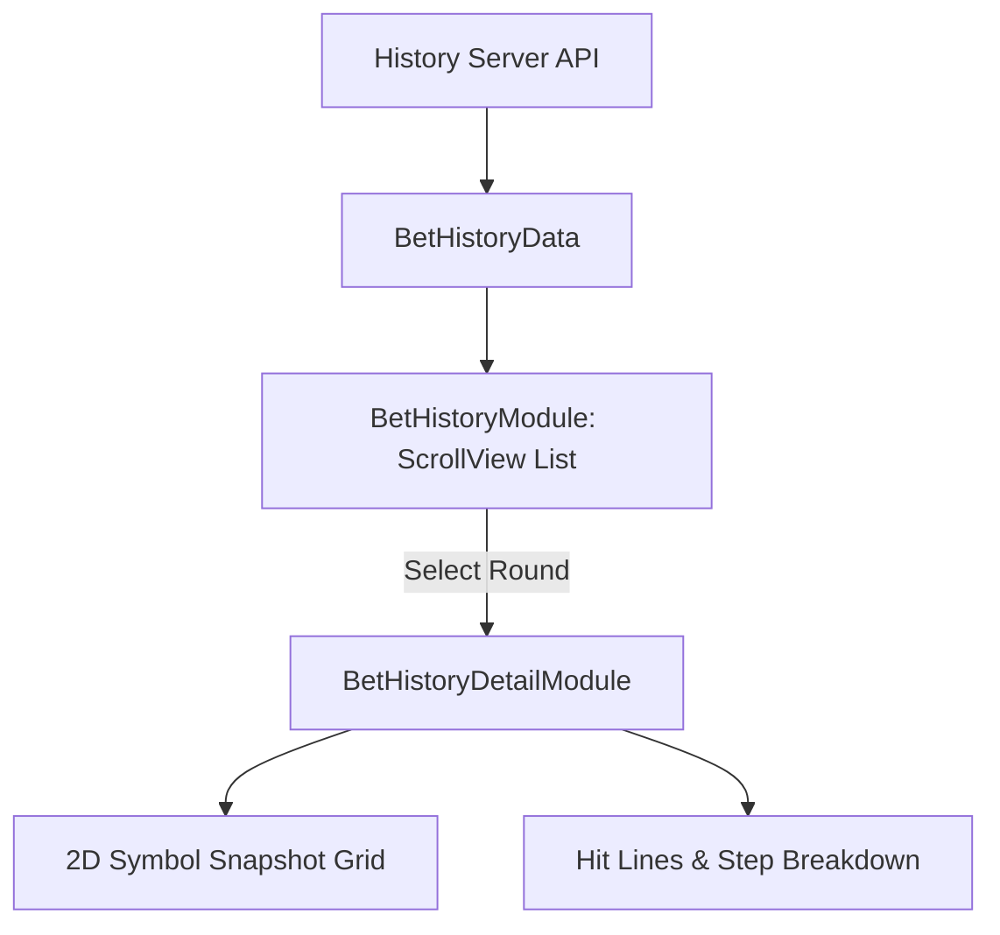

# 📊 Bet & Jackpot History Subsystem

<!-- convention-summary-start -->
### Bet & Jackpot History Subsystem Summary

- **Core Architecture / Purpose**: Technical reference, API contract, and integration guide for Bet & Jackpot History Subsystem.
- **Key Mechanisms & Design**: Encapsulates core algorithms, event hooks, and performance optimizations within the slot framework runtime.
- **Domain Capabilities**: cc_slot_module, 09_popups_history_settings_system
- **Scope & Code Paths**: `assets/cc-common/cc-slot-module/`
- **Related Docs**: [Master Index](../INDEX.md)
<!-- convention-summary-end -->

---

## 1. Architecture & Capabilities

The History subsystem enables players to verify transparency and review past round details:
1. **Summary List (`BetHistoryModule`)**: Paginated table fetching round IDs, timestamps, total bet amounts, win amounts, and free spin indicators from the backend API.
2. **Granular Round Replay (`BetHistoryDetailModule`)**: Renders visual snapshots of the 2D symbol matrix for the selected round, highlighting winning paylines, multipliers, and bonus mini-game steps.
3. **Jackpot Leaderboard (`JackpotHistoryModule`)**: Displays chronological lists of Grand/Major/Minor jackpot winners across the server room.

