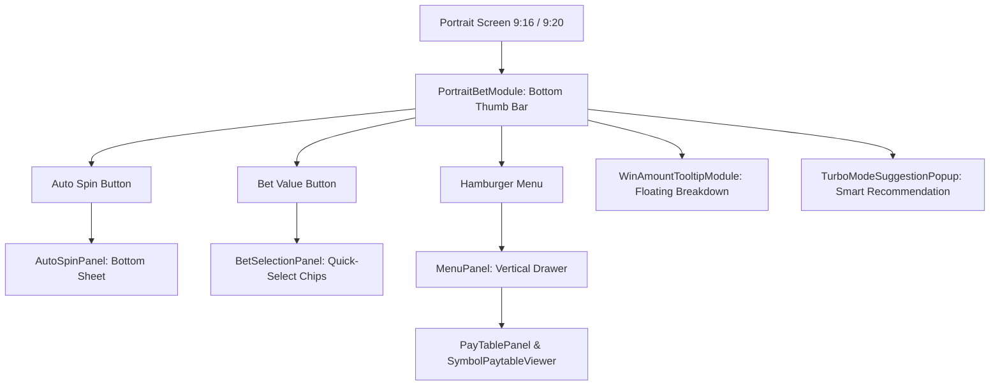

# 📱 Portrait Mobile UI Experience System Architecture Index

<!-- convention-summary-start -->
### Portrait Mobile UI Experience System Architecture Index Summary

- **Core Architecture / Purpose**: Technical reference, API contract, and integration guide for Portrait Mobile UI Experience System Architecture Index.
- **Key Mechanisms & Design**: Encapsulates core algorithms, event hooks, and performance optimizations within the slot framework runtime.
- **Domain Capabilities**: cc_slot_module, 10_portrait_mobile_ui_experience_system
- **Scope & Code Paths**: `./01_portrait_hud_orchestration.md`, `./02_bottom_sheet_drawers_and_menus.md`, `./03_vertical_paytable_and_symbol_viewer.md`
- **Related Docs**: [`01_portrait_hud_orchestration.md`](./01_portrait_hud_orchestration.md), [`02_bottom_sheet_drawers_and_menus.md`](./02_bottom_sheet_drawers_and_menus.md), [`03_vertical_paytable_and_symbol_viewer.md`](./03_vertical_paytable_and_symbol_viewer.md)
<!-- convention-summary-end -->

---

## 1. Subsystem Mission

The **Base Portrait Mobile UI Subsystem** delivers an ergonomic, thumb-friendly mobile slot experience designed for single-handed vertical smartphone play ($9:16$ / $9:19.5$ aspect ratios). It replaces traditional desktop control bars with gesture-driven sliding bottom sheets, vertical paytables, floating win breakdown tooltips, and intelligent Turbo suggestions.

---

## 2. Topic Breakdown & Navigation

1. **[`01_portrait_hud_orchestration.md`](./01_portrait_hud_orchestration.md)**
   - Portrait layout anatomy, thumb-reachable interaction zones, safe area insets for notches.
2. **[`02_bottom_sheet_drawers_and_menus.md`](./02_bottom_sheet_drawers_and_menus.md)**
   - Sliding bottom-sheet drawers: `AutoSpinPanel` (10..100 rounds), `BetSelectionPanel` (bet chips), and `MenuPanel` (hamburger drawer).
3. **[`03_vertical_paytable_and_symbol_viewer.md`](./03_vertical_paytable_and_symbol_viewer.md)**
   - Scrollable vertical paytable rules (`PayTablePanel`) and interactive symbol payout inspector (`SymbolPaytableViewer`).
4. **[`04_mobile_ux_tooltips_and_turbo_suggestion.md`](./04_mobile_ux_tooltips_and_turbo_suggestion.md)**
   - Floating win bubbles (`WinAmountTooltipModule`) and contextual Turbo activation prompts (`TurboModeSuggestionPopup`).
