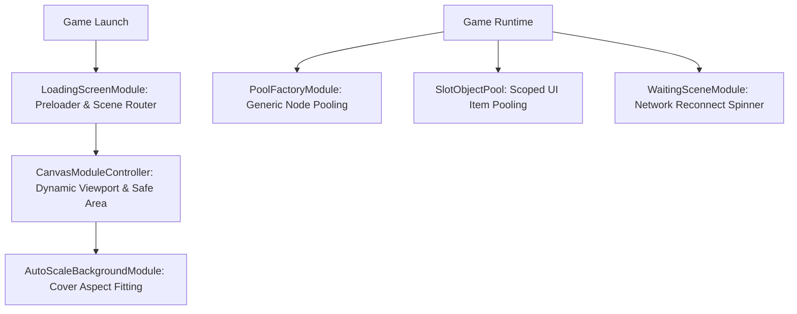

# ⚙️ Pooling, Compatibility & Utility Services System Architecture Index

<!-- convention-summary-start -->
### Pooling, Compatibility & Utility Services System Architecture Index Summary

- **Core Architecture / Purpose**: Technical reference, API contract, and integration guide for Pooling, Compatibility & Utility Services System Architecture Index.
- **Key Mechanisms & Design**: Encapsulates core algorithms, event hooks, and performance optimizations within the slot framework runtime.
- **Domain Capabilities**: cc_slot_module, 11_pooling_compatibility_and_utility_services
- **Scope & Code Paths**: `./01_zero_allocation_pooling_architecture.md`, `./02_responsive_canvas_adaptation_engine.md`, `./03_cover_background_aspect_ratio_fitting.md`
- **Related Docs**: [`01_zero_allocation_pooling_architecture.md`](./01_zero_allocation_pooling_architecture.md), [`02_responsive_canvas_adaptation_engine.md`](./02_responsive_canvas_adaptation_engine.md), [`03_cover_background_aspect_ratio_fitting.md`](./03_cover_background_aspect_ratio_fitting.md)
<!-- convention-summary-end -->

---

## 1. Subsystem Mission

The **Pooling, Compatibility & Utility Services Subsystem** provides engine-level optimization, cross-platform resolution adaptation, cover background scaling, asset preloading, and connection latency overlays.

---

## 2. Topic Breakdown & Navigation

1. **[`01_zero_allocation_pooling_architecture.md`](./01_zero_allocation_pooling_architecture.md)**
   - Object pooling triad: `PoolFactoryModule`, `SlotObjectPool`, and `SlotCustomNodePool` for zero-GC spin loops.
2. **[`02_responsive_canvas_adaptation_engine.md`](./02_responsive_canvas_adaptation_engine.md)**
   - Multi-resolution adaptation, dynamic design resolutions, orientation change listeners, and widget reflow.
3. **[`03_cover_background_aspect_ratio_fitting.md`](./03_cover_background_aspect_ratio_fitting.md)**
   - Mathematical formula for letterbox-free cover background scaling across 21:9, 16:9, and 4:3 screen ratios.
4. **[`04_asset_preloader_and_multi_target_routing.md`](./04_asset_preloader_and_multi_target_routing.md)**
   - Scene preloader pipeline, smooth progress interpolation, and SD / IFrame / History scene redirection.
5. **[`05_network_latency_and_waiting_overlays.md`](./05_network_latency_and_waiting_overlays.md)**
   - Reactive latency spinner observing `WaitingSceneData.active` with touch swallowing.
