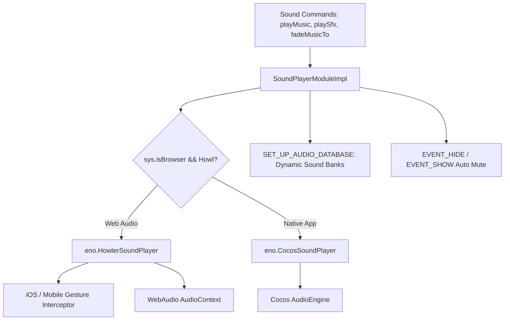

# 🔊 Dual Audio Engine & Sound Pipeline Architecture Index

<!-- convention-summary-start -->
### Dual Audio Engine & Sound Pipeline Architecture Index Summary

- **Core Architecture / Purpose**: Technical reference, API contract, and integration guide for Dual Audio Engine & Sound Pipeline Architecture Index.
- **Key Mechanisms & Design**: Encapsulates core algorithms, event hooks, and performance optimizations within the slot framework runtime.
- **Domain Capabilities**: cc_slot_module, 12_dual_audio_engine_and_sound_pipeline
- **Scope & Code Paths**: `./01_dual_audio_backend_architecture.md`, `./02_mobile_browser_audiocontext_unlock.md`, `./03_dynamic_sound_bank_loading.md`
- **Related Docs**: [`01_dual_audio_backend_architecture.md`](./01_dual_audio_backend_architecture.md), [`02_mobile_browser_audiocontext_unlock.md`](./02_mobile_browser_audiocontext_unlock.md), [`03_dynamic_sound_bank_loading.md`](./03_dynamic_sound_bank_loading.md)
<!-- convention-summary-end -->

---

## 1. Subsystem Mission

The **Dual Audio Engine & Sound Pipeline Subsystem** delivers seamless, zero-latency audio choreography across desktop browsers, mobile web, and native mobile apps. It abstracts underlying platform sound drivers into a unified API supporting BGM ducking, reel spin loops, near-win anticipation tension, coin count-up rollups, and dynamic sound bank loading.

---

## 2. Topic Breakdown & Navigation

1. **[`01_dual_audio_backend_architecture.md`](./01_dual_audio_backend_architecture.md)**
   - Dual driver architecture: `eno.HowlerSoundPlayer` (WebAudio API) vs `eno.CocosSoundPlayer` (Native AudioEngine).
2. **[`02_mobile_browser_audiocontext_unlock.md`](./02_mobile_browser_audiocontext_unlock.md)**
   - Overcoming iOS Safari and Mobile Chrome autoplay restrictions via first-touch user gesture interception and context suspension/resumption.
3. **[`03_dynamic_sound_bank_loading.md`](./03_dynamic_sound_bank_loading.md)**
   - Dynamic audio asset loading via `SET_UP_AUDIO_DATABASE` and memory release via `assetManager.releaseAsset()`.
4. **[`04_sound_convert_list_and_volume_fading.md`](./04_sound_convert_list_and_volume_fading.md)**
   - Logical sound IDs (`SoundConvertList`), smooth volume fading, crossfades (`mixTime`), and one-shot polyphony management.
