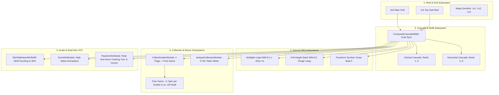

# ⚔️ Red Cliff (g9666) Master Game Features Deep Dive

<!-- convention-summary-start -->
### Red Cliff (g9666) Master Game Features Deep Dive Summary

- **Core Architecture / Purpose**: Comprehensive engineering and design dossier detailing every interactive gameplay feature, mathematical model, and module interaction in Red Cliff (g9666).
- **Key Mechanisms & Design**: Covers Grid layout, Composite Dual Cascade, Multiplier Ingot Wilds, Zhuge Liang Full-height Stack Wilds, Scatter Flag Free Game, 4-Tier Hero Token Jackpot, Transform Symbols, Near-Win Refill Anticipation, Real-Time Spine Bone Tracking, and State Directors.
- **Domain Capabilities**: game_implement, g9666_red_cliff
- **Scope & Code Paths**: `assets/cc-release-slot/cc1-red-cliff/scripts/`
- **Related Docs**: [00_EXECUTIVE_SUMMARY_AND_SPEC.md](./00_EXECUTIVE_SUMMARY_AND_SPEC.md), [Master Index](./INDEX.md)
<!-- convention-summary-end -->

---

## 🗺️ Master Gameplay Features Architecture Map



---

## 1. Grid Layout, Mega Symbols & Ways System

### 1.1 Physical Grid Architecture
- **Vertical Main Board**: 6 columns $\times$ 4 rows (`TABLE_FORMAT = [4, 4, 4, 4, 4, 4]`).
  - Source: [`TableModuleConfig9666.ts`](file:///c:/Users/ADMIN/lamnino/cc20-new-all-in-one/assets/cc-release-slot/cc1-red-cliff/scripts/Table/TableModuleConfig9666.ts).
  - Cell dimensions: `SYMBOL_WIDTH = 141`, `SYMBOL_HEIGHT = 110`.
- **Top Sub-Reel (Horizontal Table)**:
  - Positioned above Reels 2, 3, 4, and 5 (`HorizontalTableModule9666.ts`).
  - Contains 4 single cells arranged horizontally. Each cell visually and logically extends the height of Reels 2, 3, 4, and 5 by $+1$.
  - Reel effective symbol heights: `[4, 5, 5, 5, 5, 4]`.
- **Ways to Win Evaluation**:
  - `PAY_SYSTEM = PAY_SYSTEM_TYPE_ENUM.ALLWAYS`.
  - Theoretical Maximum Ways: $4 \times 5 \times 5 \times 5 \times 5 \times 4 = 10,000 \text{ Ways}$.

### 1.2 Multi-Size Mega Symbols
- Standard symbols (`2`, `3`, `4`, `5`, `6`, `7`, `8`, `9`, `B`, `C`, `D`) can appear in 3 discrete vertical heights:
  - Height 1: Standard single cell (`1x1`).
  - Height 2: Tall symbol spanning 2 cells (`1x2`, e.g., `2_1_2`).
  - Height 3: Large symbol spanning 3 cells (`1x3`, e.g., `2_1_3`).
- **Special Symbols Exception**:
  - Special symbols (`A` Scatter, `K` Wild, `K1` Multiplier Wild, `K2` Stack Wild) are **strictly $1 \times 1$ only**.
- **Rendering & Border Sync**:
  - Low-pay Royals (`8`, `9`, `B`, `C`, `D`) load dynamic Spine border frames on track 1 via `reel_${this.size.y}` (`SlotSymbolModule9666.ts`).
  - High-pay heroes (`2`, `3`, `4`) append `_reel_${this.size.y}` to their win and appear animations.

---

## 2. Composite Dual Cascade Subsystem

### 2.1 Coordination Model
In Red Cliff, a cascade drop is **two-dimensional**:
1. **Vertical Gravity Drop** ([`VerticalCascadeModule9666.ts`](file:///c:/Users/ADMIN/lamnino/cc20-new-all-in-one/assets/cc-release-slot/cc1-red-cliff/scripts/GameModule/VerticalCascadeModule9666.ts)): Winning symbols on Reels 1..6 explode. Surviving symbols fall down under gravity, and new refill symbols drop in from above.
2. **Horizontal Slide Shift** ([`HorizontalCascadeModule9666.ts`](file:///c:/Users/ADMIN/lamnino/cc20-new-all-in-one/assets/cc-release-slot/cc1-red-cliff/scripts/Table/HorizontalCascadeModule9666.ts)): Winning symbols on the top horizontal reel explode. Surviving symbols shift leftward, and new symbols enter from the right.
3. **Synchronization**:
   - Managed by [`CompositeCascade9666.ts`](file:///c:/Users/ADMIN/lamnino/cc20-new-all-in-one/assets/cc-release-slot/cc1-red-cliff/scripts/Table/CompositeCascade9666.ts).
   - Executes both drops simultaneously using `Promise.all([verticalPromise, horizontalPromise])`.
   - Fires sequence of synchronized events:
     `UPDATE_JACKPOT_COLLECTION` $\rightarrow$ `UPDATE_MEGAWAY` $\rightarrow$ `STACK_WILD_LANDED` $\rightarrow$ `COLLECT_WILD_MULTIPLIER`.

---

## 3. Multiplier Wild Subsystem (Kim Nguyên Bảo - Chu Du)

### 3.1 Badge Lifecycle & Collection
- **Symbol Code**: `K1-x` (e.g. `K1-2`, `K1-3`, `K1-4`, `K1-5`, `K1-8`).
- **Badge Label**:
  - In [`SlotSymbolModule9666.ts`](file:///c:/Users/ADMIN/lamnino/cc20-new-all-in-one/assets/cc-release-slot/cc1-red-cliff/scripts/Table/SlotSymbolModule9666.ts), `multiplierLabel` displays `x{multiplier}` on top of the golden ingot.
  - Plays `idle_multi` animation state while on reel.
- **Collection on Win/Stop**:
  - When the spin or cascade step resolves, [`CollectMultiModule9666.ts`](file:///c:/Users/ADMIN/lamnino/cc20-new-all-in-one/assets/cc-release-slot/cc1-red-cliff/scripts/Gui/CollectMultiModule9666.ts) dispatches flying particle tokens from each uncollected `K1` node towards the HUD Multiplier Banner.
  - The symbol transitions to `transition_multi` $\rightarrow$ `idle`, sets `hasCollectedMultiplier = true`, and hides its multiplier badge.
- **Consolidated Multiplier Banner**:
  - [`MultiplierModule9666.ts`](file:///c:/Users/ADMIN/lamnino/cc20-new-all-in-one/assets/cc-release-slot/cc1-red-cliff/scripts/Gui/MultiplierModule9666.ts) maintains `MultiplierModule9666.currentMultiplier`.
  - When a multiplier token hits the banner:
    - Label scales up ($1.0 \rightarrow 1.4 \rightarrow 1.0$) with bounce action.
    - SFX `MULTIPLIER_INCREASE` is played.
- **Unexploded Wild Reversion**:
  - If a `K1` symbol remains on the board across cascade steps without exploding in a win line, its badge remains hidden for subsequent steps of that spin.
  - On a brand-new spin (`START_SPINNING`), all symbol modules reset `hasCollectedMultiplier = false`.
- **Reconnect & Smart Resume Flow**:
  - If the player reconnects during a cascade, `CollectMultiModuleData.isResumeMode()` inspects `dataResume.previousMultiplier`.
  - Any already-landed `K1` symbols on the visible board immediately have their badges hidden, and the multiplier banner displays the restored multiplier value.

---

## 4. Expanding Stack Wild Subsystem (Gia Cát Lượng `K2`)

### 4.1 Trigger & Expansion Flow
- **Symbol Code**: `K2` (Gia Cát Lượng - Zhuge Liang).
- **Z-Index Elevation**: When `K2` appears, [`SlotSymbolModule9666.ts`](file:///c:/Users/ADMIN/lamnino/cc20-new-all-in-one/assets/cc-release-slot/cc1-red-cliff/scripts/Table/SlotSymbolModule9666.ts) sets `node.zIndex = 10` (elevated above all standard symbols).
- **Full-Column Expansion**:
  - Handled by [`StackWildModule.ts`](file:///c:/Users/ADMIN/lamnino/cc20-new-all-in-one/assets/cc-release-slot/cc1-red-cliff/scripts/Table/StackWildModule.ts).
  - When event `STACK_WILD_LANDED` fires:
    1. Plays SFX `SYMBOL_GCL_ACTIVATE` followed by `WILD_EXPAND`.
    2. Instantiates `columnEffectTemplate` (Spine flaming column VFX) spanning the entire vertical column.
    3. Replaces all symbols in that column on the main table with Wild symbols (`K, K, K, K`).
    4. Ensures that any ways calculation evaluates that entire column as 100% Wild substitutions.
- **Fast-Stop Protection**:
  - Implements `_pendingInResolvers` and `TABLE_FAST_STOP` listeners to immediately resolve pending animations without crashing the cascade pipeline.

---

## 5. Scatter Flag Collection & Free Game Mode

### 5.1 Scatter Collection in Normal Game
- **Symbol Code**: `A` (Chiến Thuyền / Warship Scatter).
- **Flag Collection**:
  - Handled by [`CollectScatterModule.ts`](file:///c:/Users/ADMIN/lamnino/cc20-new-all-in-one/assets/cc-release-slot/cc1-red-cliff/scripts/Gui/CollectScatterModule.ts).
  - Normal Game features 4 War Flags on the HUD.
  - When `COLLECT_SCATTER` triggers alongside `TABLE_START_RESPIN`:
    - Scatter symbols explode from the board.
    - Particle beams fly from each Scatter index to the HUD flags.
    - Matching flags ignite with `collectEffectFlagTemplate` and play SFX `SCATTER_MATCH`.
- **Free Game Trigger**:
  - Collecting 4, 5, or 6 Scatters triggers the Free Game feature:
    - **4 Scatters**: 7 Free Spins
    - **5 Scatters**: 8 Free Spins
    - **6 Scatters**: 9 Free Spins

### 5.2 Free Game Mode Rules & Extra Spins
- **Progressive Cascade Multiplier**:
  - Free Game multiplier starts at $\times 2$.
  - After **every single cascade**, the multiplier increases by $+ \times 2$, up to a maximum of $\times 20$.
- **Extra Free Spins (+1 per Scatter)**:
  - In Free Game mode, every Scatter symbol `A` that lands awards **+1 additional Free Spin**.
  - `CollectScatterModule` spawns `collectEffectSpinTemplate`, plays SFX `ADD_SPIN`, and emits `ADD_FREE_SPIN_TIMES(1)` to [`FreeGameDirectorModule9666.ts`](file:///c:/Users/ADMIN/lamnino/cc20-new-all-in-one/assets/cc-release-slot/cc1-red-cliff/scripts/GameMode/FreeGameDirectorModule9666.ts).
  - Updates the HUD `SpinTimesModule` live during the cascade sequence.

---

## 6. 4-Tier Troop Token Jackpot Collection Subsystem

### 6.1 Hero Token Tiers & Thresholds
- Source: [`JackpotCollectionModule9666.ts`](file:///c:/Users/ADMIN/lamnino/cc20-new-all-in-one/assets/cc-release-slot/cc1-red-cliff/scripts/Gui/JackpotCollectionModule9666.ts), [`JackpotCollectionData9666.ts`](file:///c:/Users/ADMIN/lamnino/cc20-new-all-in-one/assets/cc-release-slot/cc1-red-cliff/scripts/Gui/JackpotCollectionData9666.ts).
- Network Schema: Array of strings `collectSymbols: ["S4:3:6", "S3:2:9", "S2:5:12", "S1:1:15"]` (format `symbolCode:collected:required`).

| Tier Index | Jackpot Tier | Hero Code & Character | Required Tokens | Payout Multiplier |
| :---: | :---: | :---: | :---: | :---: |
| **0** | **Mini** | `S4` / Triệu Vân (Zhao Yun) | 6 Tokens | $20\times$ Total Bet |
| **1** | **Minor** | `S3` / Trương Phi (Zhang Fei) | 9 Tokens | $50\times$ Total Bet |
| **2** | **Major** | `S2` / Lưu Bị (Liu Bei) | 12 Tokens | $200\times$ Total Bet |
| **3** | **Grand** | `S1` / Quan Vũ (Guan Yu) | 15 Tokens | $1,000\times$ Total Bet |

### 6.2 Token Collection & Smart Resume Math
- **Fly-In Particle**:
  - Winning Hero symbols dispatch particle streams to [`JackpotCollectionItem9666`](file:///c:/Users/ADMIN/lamnino/cc20-new-all-in-one/assets/cc-release-slot/cc1-red-cliff/scripts/Gui/JackpotCollectionItem9666.ts).
  - Plays SFX `COLLECT_SYMBOL`. When all required tokens are collected, plays SFX `COLLECT_COMPLETE` and emits `ON_COLLECT_COMPLETE` $\rightarrow$ triggers [`JackpotWinModule9666.ts`](file:///c:/Users/ADMIN/lamnino/cc20-new-all-in-one/assets/cc-release-slot/cc1-red-cliff/scripts/Cutscene/JackpotWinModule9666.ts).
- **Smart Resume Deduction Algorithm**:
  - When a player reconnects mid-round, the server's `collectSymbols` already includes tokens collected from the *current* winning spin.
  - To prevent displaying the final token count before the win animation plays, `JackpotCollectionModule9666.onJoinGameSuccess()` computes:
    $$C_{\text{before}} = \max(0, C_{\text{total}} - W_{\text{current}})$$
  - Where $W_{\text{current}}$ is calculated by scanning `parsedPaylines` and `traceWay` for instances of the winning hero symbol (including Wild substitutions).
  - This guarantees the UI meter displays the pre-spin count, allowing the animation to naturally increment to the full server count.

---

## 7. Transform Symbol Subsystem

### 7.1 Architecture & Flow
- Source: [`TransformSymbolModule9666 .ts`](file:///c:/Users/ADMIN/lamnino/cc20-new-all-in-one/assets/cc-release-slot/cc1-red-cliff/scripts/Table/TransformSymbolModule9666%20.ts), [`TransformSymbolModuleData9666.ts`](file:///c:/Users/ADMIN/lamnino/cc20-new-all-in-one/assets/cc-release-slot/cc1-red-cliff/scripts/Table/TransformSymbolModuleData9666.ts).
- **Trigger**: Server payload contains `transformSymbols` data indicating matrix indices that morph into Wild Thuyền Cỏ (`K`).
- **Dynamic Pool Instantiation**:
  - Instead of mutating existing symbol instances in-place, `TransformSymbolModule9666` retrieves fresh symbols from `SlotSymbolManager9666` with `SymbolOwnerType.TRANSFORM_SYMBOL`.
  - Calculates exact 2D coordinates using `getColRowFromIndex(symbolIndex, [4, 5, 5, 5, 5, 4])`.
  - Overlays the new `K` symbol precisely over the slot cell.
  - Synchronizes with `TABLE_STOP_SPIN` to clean up temporary nodes after vertical reels settle.

---

## 8. Near Win Refill & Sure Win Anticipation

### 8.1 Near Win Refill Mechanics
- Source: [`SlotTableNearWinRefillModule9666.ts`](file:///c:/Users/ADMIN/lamnino/cc20-new-all-in-one/assets/cc-release-slot/cc1-red-cliff/scripts/Table/SlotTableNearWinRefillModule9666.ts).
- **Condition**: In Normal Game, when 3 Scatter symbols (`A`) are visible on the board and subsequent reels/cells are still cascading or refilling:
  - Emits `TRIGGER_NEAR_WIN`.
  - **BGM Ducking**: Dynamically fades main music down to **30% volume** (`bgmDuckVolumeRatio = 0.3`, `bgmDuckFadeTime = 0.2s`) via `soundPlayer.fadeMusicTo()`.
  - Plays suspenseful loop SFX `NEARWIN_REFILL`.
- **Resolution**:
  - When the refill cascade ends, BGM fades back to 100% volume.
  - If the 4th Scatter does **not** appear: Plays SFX `NEARWIN_MISS`.
  - If the 4th Scatter appears: Triggers Free Game transition.

### 8.2 Sure Win Presentation
- Source: [`SureWinModule9666.ts`](file:///c:/Users/ADMIN/lamnino/cc20-new-all-in-one/assets/cc-release-slot/cc1-red-cliff/scripts/Gui/SureWinModule9666.ts).
- Triggered when `playSession.sureWin === 1`.
- Fades in dark overlay backdrop on both vertical and horizontal tables (`opacity: 150`).
- Plays full-screen anticipation Spine cutscene: `in` $\rightarrow$ `loop` $\rightarrow$ `active` $\rightarrow$ `out`.
- Guarantees high-paying win line presentation.

---

## 9. Real-Time Spine Bone Tracking & Payline Sync

### 9.1 Bone-to-Node Transformation Pipeline
- Source: [`PaylineInfoModule9666.ts`](file:///c:/Users/ADMIN/lamnino/cc20-new-all-in-one/assets/cc-release-slot/cc1-red-cliff/scripts/Gui/PaylineInfoModule9666.ts).
- Complex win presentations require UI labels (`multiLabel`, `winAmountLabel`) to follow moving bones in a Spine VFX skeleton (`hsnCombineSpine`):
  1. Calls `hsnCombineSpine.updateWorldTransform()`.
  2. Finds target bone (`bone = hsnCombineSpine.findBone('hsn')` or `'money'`).
  3. Converts bone coordinates to Cocos World Space:
     `worldPos = hsnCombineSpine.node.convertToWorldSpaceAR(cc.v2(bone.worldX, bone.worldY))`
  4. Converts World Space to local UI node parent space:
     `localPos = targetNode.parent.convertToNodeSpaceAR(worldPos)`
  5. Updates `targetNode.position = localPos` on **every single frame** inside `update(dt)`.
- **Spine Event Handlers**:
  - `add_money`: Triggers incremental win amount count-up.
  - `add_ktt`: Triggers consolidated multiplier increment.

---

## 10. Directors, Writers & Lifecycle FSM

- **Normal Game Pipeline** ([`NormalGameWriterModule9666.ts`](file:///c:/Users/ADMIN/lamnino/cc20-new-all-in-one/assets/cc-release-slot/cc1-red-cliff/scripts/GameMode/NormalGameWriterModule9666.ts)):
  ```
  _startSpinningTable (_resetMultiplier -> 1x)
    └── _stopSpinningTopTable & _stopSpinningTable
          └── _syncStackWild (K2 Zhuge Liang expansion)
                └── _collectWildMultiplier (K1 Zhou Yu ingot badge flying)
                      └── _setUpPaylines -> _showRespinResultEntry (Cascade loop)
                            └── _playJackpotWin -> _showResultEntry
  ```
- **Free Game Pipeline** ([`FreeGameWriterModule9666.ts`](file:///c:/Users/ADMIN/lamnino/cc20-new-all-in-one/assets/cc-release-slot/cc1-red-cliff/scripts/GameMode/FreeGameWriterModule9666.ts)):
  ```
  _beforeSpinStart -> _decreaseFreeGameSpinTimes
    └── _resetMultiplier (starts at 2x)
          └── _stopSpinningTable
                └── _syncStackWild
                      └── _collectWildMultiplier
                            └── Respin/Cascade loop: Multiplier increases +2x per step (max 20x)
                                  └── _collectScatter (each Scatter adds +1 Free Spin)
  ```
