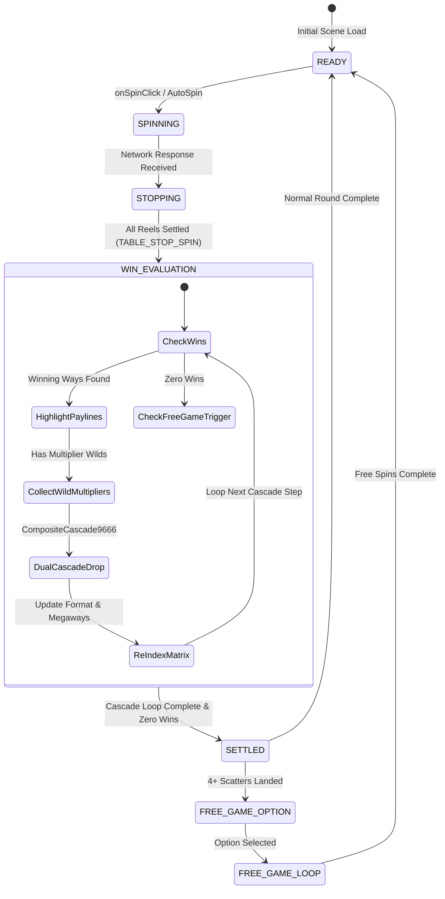

# 🔄 Red Cliff (g9666) Lifecycle Architecture & Master Flow

<!-- convention-summary-start -->
### Red Cliff (g9666) Lifecycle Architecture & Master Flow Summary

- **Core Architecture / Purpose**: Technical reference, API contract, and integration guide for Red Cliff (g9666) Lifecycle Architecture & Master Flow.
- **Key Mechanisms & Design**: Encapsulates core algorithms, event hooks, and performance optimizations within the slot framework runtime.
- **Domain Capabilities**: game_implement, g9666_red_cliff
- **Scope & Code Paths**: `assets/cc-common/`
- **Related Docs**: [Master Index](../INDEX.md)
<!-- convention-summary-end -->

---

## 1. Master Finite State Machine (FSM)

---

## 2. Spin Start Sequence & State Reset Pipeline

When a new spin initiates, the following sequential commands execute:
1. **`onBeforeSpinStart`** $\rightarrow$ Locks bet buttons, cancels pending win animations.
2. **`_resetTable`** $\rightarrow$ Emits:
   - `BEFORE_RESET_TABLE`
   - `CLEAR_PAYLINES`
   - `SYNC_TABLE`
   - `RESET_MULTIPLIER` (resets multiplier banner to baseline $\times 1$ in Base Game or active sticky in Free Game)
   - `RESET_SCATTER_COUNT`
3. **Symbol Reversion**: Multiplier Wilds that did not explode in previous cascades reset `hasCollectedMultiplier = false` and re-show their multiplier badge.
