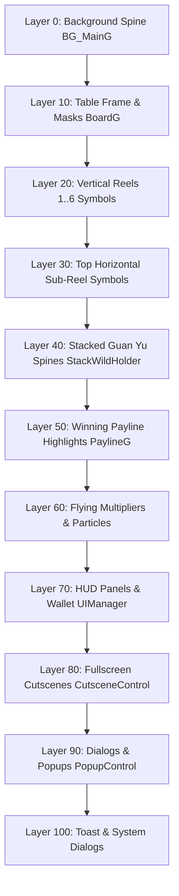

# 🎨 Red Cliff (g9666) Render Layers & Z-Index Specification

<!-- convention-summary-start -->
### Red Cliff (g9666) Render Layers & Z-Index Specification Summary

- **Core Architecture / Purpose**: Technical reference, API contract, and integration guide for Red Cliff (g9666) Render Layers & Z-Index Specification.
- **Key Mechanisms & Design**: Encapsulates core algorithms, event hooks, and performance optimizations within the slot framework runtime.
- **Domain Capabilities**: game_implement, 02_scene_and_prefabs
- **Scope & Code Paths**: `assets/cc-common/`
- **Related Docs**: [Master Index](../INDEX.md)
<!-- convention-summary-end -->

---

## 1. Z-Index Layering Hierarchy

