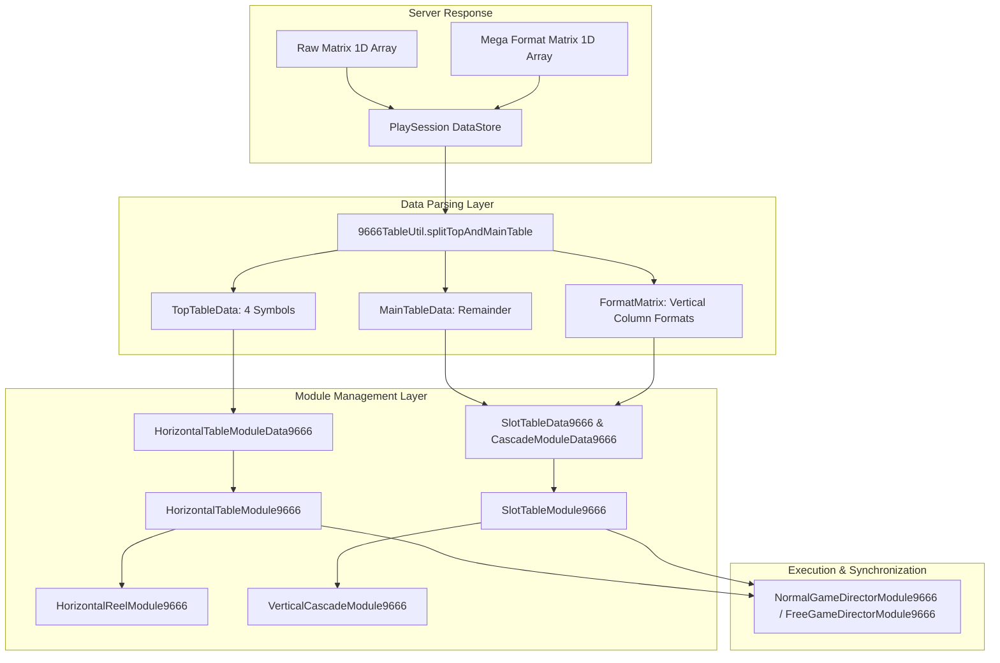

# 🌊 Red Cliff (g9666) Composite Dual Cascade Architecture & Data Flow

<!-- convention-summary-start -->
### Red Cliff (g9666) Composite Dual Cascade Architecture & Data Flow Summary

- **Core Architecture / Purpose**: Technical reference, API contract, and integration guide for Red Cliff (g9666) Composite Dual Cascade Architecture & Data Flow.
- **Key Mechanisms & Design**: Encapsulates core algorithms, event hooks, and performance optimizations within the slot framework runtime.
- **Domain Capabilities**: game_implement, 03_composite_cascade
- **Scope & Code Paths**: `9666TableUtil.ts`
- **Related Docs**: [Master Index](../INDEX.md)
<!-- convention-summary-end -->


---

## 1. Subsystem Architecture & Component Hierarchy

Red Cliff 9666 utilizes a **Composite Dual Grid** table architecture combining:
1. **Top Horizontal Table (Reels 2..5)**: 1 row $\times$ 4 columns (indices `[4, 9, 14, 19]`), sliding horizontally.
2. **Main Vertical Table (Reels 1..6)**: 6 columns with variable heights (format `[4, 4, 4, 4, 4, 4]`, supporting Mega symbols of heights 1, 2, and 3).



---

## 2. Matrix Splitting Logic (`9666TableUtil.ts`)

The backend sends a serialized 1D array representing the entire combined grid. The utility function `splitTopAndMainTable()` separates the top 4 symbols from the main vertical grid:

```typescript
export const DEFAULT_MEGA_FORMAT_MATRIX: string[] = ['1111', '11111', '11111', '11111', '11111', '1111'];

export function splitTopAndMainTable(rawMatrix: string[], megaFormatMatrix: string[]): MainTableMatrixResult {
    const topTableData: string[] = [];
    const mainTableData: string[] = [];
    const formatMatrix: string[] = [];
    let pointer = 0;

    if (!rawMatrix || !rawMatrix.length) {
        return { topTableData, mainTableData, formatMatrix };
    }

    const fmtMatrix = (megaFormatMatrix && Array.isArray(megaFormatMatrix) && megaFormatMatrix.length > 0)
        ? megaFormatMatrix
        : DEFAULT_MEGA_FORMAT_MATRIX;

    fmtMatrix.forEach((reelSymbolSize, index) => {
        let symbolCount = reelSymbolSize.length;
        let formatSymbolSize = reelSymbolSize;

        // Middle reels (indices 1, 2, 3, 4 corresponding to Reels 2, 3, 4, 5) donate the first symbol to the top horizontal reel
        if (index !== 0 && index !== 5) {
            topTableData.push(rawMatrix[pointer]);
            pointer++;
            symbolCount--;
            formatSymbolSize = reelSymbolSize.slice(1);
        }

        for (let i = 0; i < symbolCount; i++) {
            mainTableData.push(rawMatrix[pointer]);
            pointer++;
        }
        formatMatrix.push(formatSymbolSize);
    });

    return { topTableData, mainTableData, formatMatrix };
}
```

---

## 3. Data Flow Between Data Modules & Managers

| Data Module | Target Class | Responsibilities |
| :--- | :--- | :--- |
| **`HorizontalTableModuleData9666`** | `HorizontalTableModule9666` | Extracts `topTableData`, formats to 2D `[[sym0, sym1, sym2, sym3]]`, resolves `getResumeMatrix()`. |
| **`SlotTableData9666`** | `SlotTableModule9666` | Extracts `mainTableData`, converts Mega symbols via `eno.SlotUtils.convertMegaSymbols()`, formats to 2D vertical matrix. |
| **`CascadeModuleData9666`** | `VerticalCascadeModule9666` | Maps winning indices (`traceWay`) into `verticalMatrix` and `listTraceWayVertical` with `DROP_SYMBOL_CODE` markers. |
