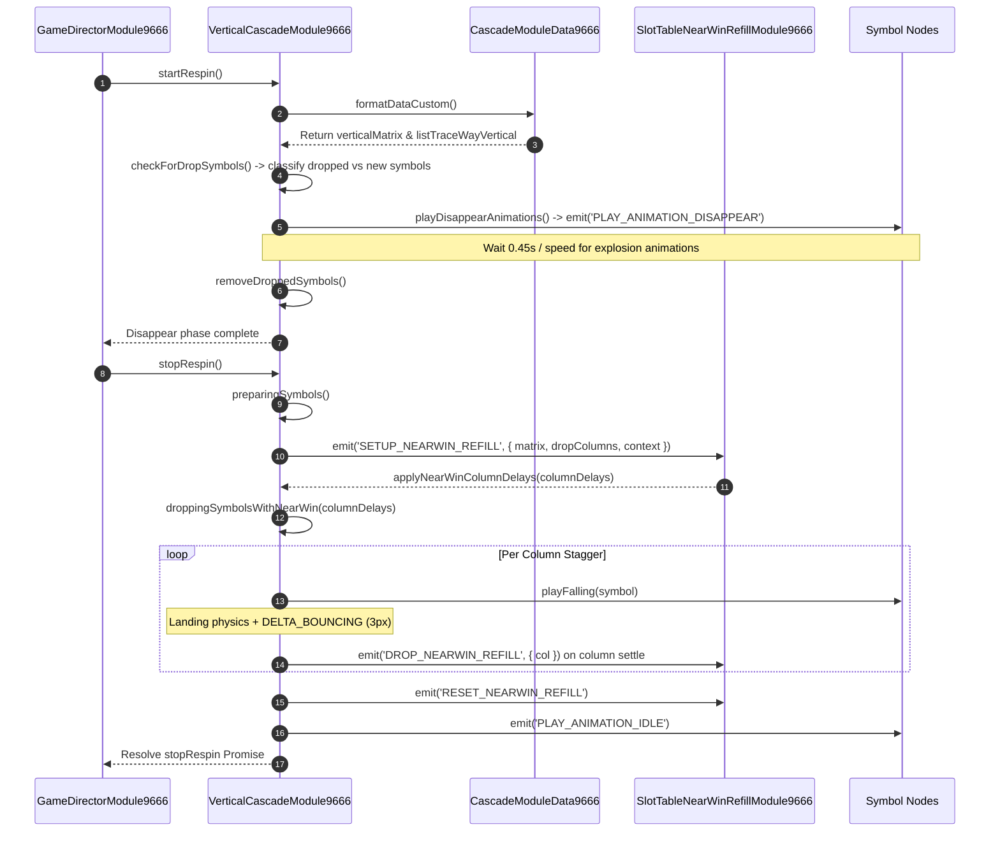

# ⬇️ Red Cliff (g9666) Vertical Cascade Mechanics & Refill

<!-- convention-summary-start -->
### Red Cliff (g9666) Vertical Cascade Mechanics & Refill Summary

- **Core Architecture / Purpose**: Technical reference, API contract, and integration guide for Red Cliff (g9666) Vertical Cascade Mechanics & Refill.
- **Key Mechanisms & Design**: Encapsulates core algorithms, event hooks, and performance optimizations within the slot framework runtime.
- **Domain Capabilities**: game_implement, 03_composite_cascade
- **Scope & Code Paths**: `assets/cc-common/`
- **Related Docs**: [Master Index](../INDEX.md)
<!-- convention-summary-end -->


---

## 1. Vertical Cascade Lifecycle Sequence

The vertical cascading process is driven by **`VerticalCascadeModule9666`**:



---

## 2. Near-Win Staggering & Delayed Refill

When a potential Scatter (`A`) or high-value condition is evaluated during cascade refills, `VerticalCascadeModule9666` applies staggered column drops:

```typescript
protected droppingSymbolsWithNearWin(columnDelays: number[]): void {
    this.fallingSymbols(this.listDroppedSymbols);

    const symbolsByColumn = new Map<number, cc.Node[]>();
    this.listNewSymbols.forEach((symbol) => {
        const realCol = this.listDropColumns[(symbol as any)['colIndex']];
        if (!symbolsByColumn.has(realCol)) {
            symbolsByColumn.set(realCol, []);
        }
        symbolsByColumn.get(realCol)!.push(symbol);
    });

    symbolsByColumn.forEach((symbols, col) => {
        const baseDelay = columnDelays[col] || 0;

        if (baseDelay <= 0) {
            symbols.forEach((symbol) => this.playFalling(symbol));
            return;
        }

        let remaining = symbols.length;
        symbols.forEach((symbol, index) => {
            const delay = baseDelay + index * this.nearWinStaggerTime;
            this.scheduleOnce(() => {
                this.playFalling(symbol);
                remaining--;
                if (remaining === 0) {
                    const landingDuration = this.getSymbolLandingDuration();
                    this.scheduleOnce(() => {
                        this.eventManager.emit("DROP_NEARWIN_REFILL", { col });
                    }, landingDuration);
                }
            }, delay);
        });
    });
}
```

---

## 3. Bounce Physics & Landing Duration Calculation

```typescript
protected calculatePosition(posX: number, posY: number): { targetPos: cc.Vec2, targetBouncePos: cc.Vec2 } {
    const targetPos = new cc.Vec2(posX, posY);
    const DELTA_BOUNCING = 3;
    const targetBouncePos = new cc.Vec2(posX, posY + DELTA_BOUNCING);

    return { targetPos, targetBouncePos };
}

protected getSymbolLandingDuration(): number {
    const { fallingTime, deltaTimeCubicIn, timeBouncing } = this.getFallingTime();
    return (fallingTime - deltaTimeCubicIn) + timeBouncing * 0.3 * 3;
}
```
This adds realistic micro-bounce physics when multi-sized symbols land onto lower symbol stacks.
