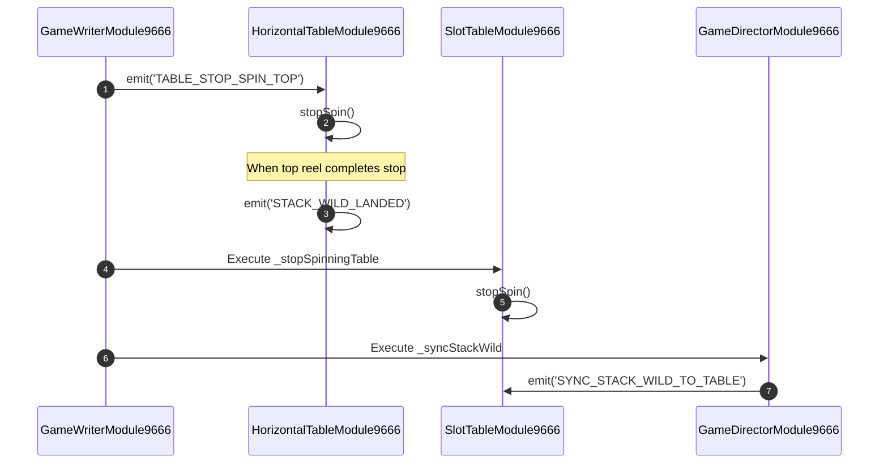

# ➡️ Red Cliff (g9666) Horizontal Top Reel Cascade Mechanics

<!-- convention-summary-start -->
### Red Cliff (g9666) Horizontal Top Reel Cascade Mechanics Summary

- **Core Architecture / Purpose**: Technical reference, API contract, and integration guide for Red Cliff (g9666) Horizontal Top Reel Cascade Mechanics.
- **Key Mechanisms & Design**: Encapsulates core algorithms, event hooks, and performance optimizations within the slot framework runtime.
- **Domain Capabilities**: game_implement, 03_composite_cascade
- **Scope & Code Paths**: `../../../../assets/cc-release-slot/cc1-red-cliff/scripts/Table/HorizontalTableModule9666.ts`, `HorizontalTableModule9666.ts`
- **Related Docs**: [Master Index](../INDEX.md)
<!-- convention-summary-end -->


---

## 1. Top Horizontal Reel Overview

The top horizontal reel serves as a specialized 4-symbol modifier track above Reels 2, 3, 4, and 5:
- **Component**: [`HorizontalTableModule9666`](../../../../assets/cc-release-slot/cc1-red-cliff/scripts/Table/HorizontalTableModule9666.ts).
- **Reel Sub-Component**: `HorizontalReelModule9666`.
- **Indices in Unified Matrix**: `[4, 9, 14, 19]`.
- **Slide Direction**: Right-to-Left slide motion.

```mermaid
graph LR
    subgraph Top Horizontal Grid
        Sym4[Index 4 (Reel 2)] --- Sym9[Index 9 (Reel 3)] --- Sym14[Index 14 (Reel 4)] --- Sym19[Index 19 (Reel 5)]
    end
    Slide[Right to Left Slide Direction] --> TopGrid
```

---

## 2. Event Lifecycle & Stack Wild Landing



---

## 3. Implementation Highlights (`HorizontalTableModule9666.ts`)

```typescript
protected registerEvents(): void {
    super.registerEvents();
    this.moduleEvent.off(TableModuleEvents.TABLE_STOP_SPIN, this.stopSpin, this);
    this.moduleEvent.on('TABLE_STOP_SPIN_TOP', this.stopSpin, this);
    this.eventManager.on('JOIN_GAME_SUCCESS', this.onJoinGameSuccess, this);
    this.moduleEvent.on(TableModuleEvents.TABLE_FAST_STOP, this.onForceStopRequested, this);
}

protected onReelStop(reelIndex: number): void {
    super.onReelStop(reelIndex);
    if (this.reelCount >= this.reels.length) {
        this._stackWildLandedPromise = this.moduleEvent.emit('STACK_WILD_LANDED');
    }
}
```

### Key Differences from Vertical Reels:
1. Listens for **`TABLE_STOP_SPIN_TOP`** instead of default `TABLE_STOP_SPIN` to allow phased stop timing between top and vertical reels.
2. Emits **`STACK_WILD_LANDED`** as soon as the horizontal track settles, allowing Wild expansion checks to be ready before vertical reels conclude their spin.
