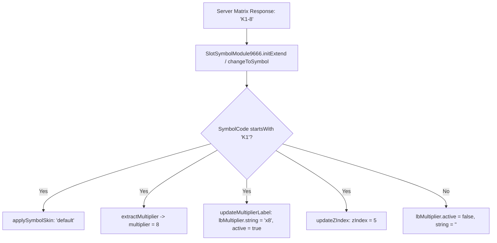
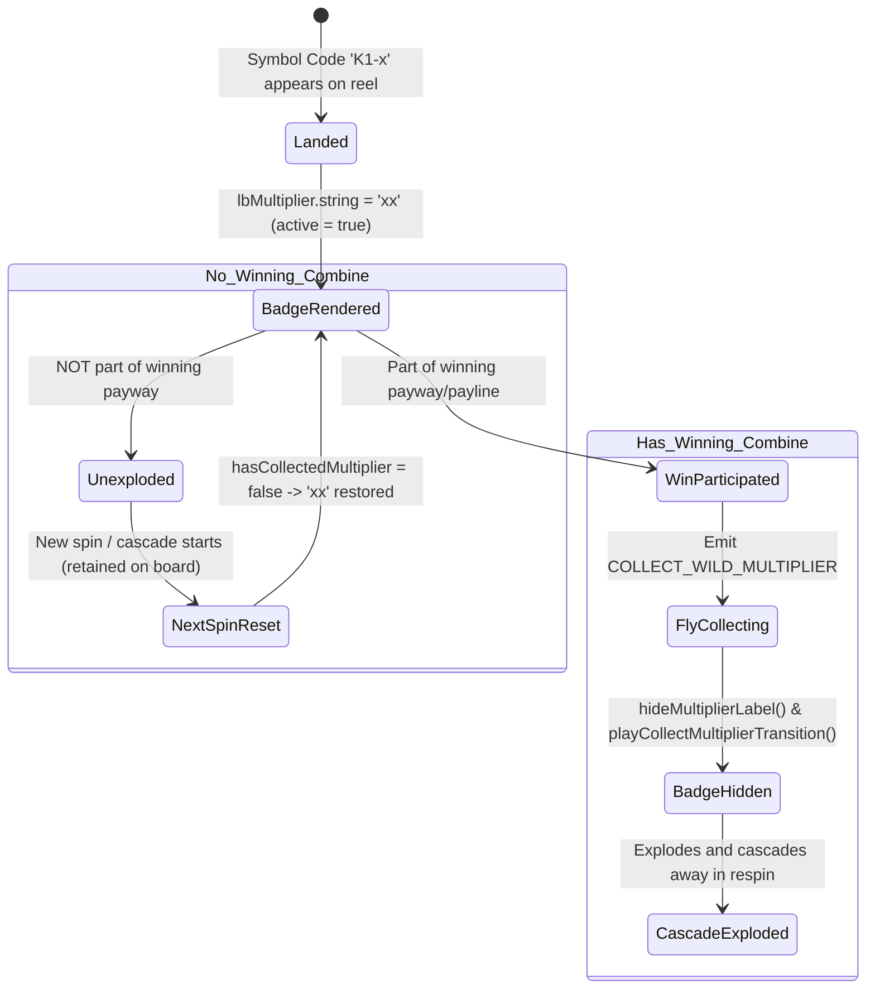

# 🌟 Red Cliff (g9666) Multiplier Wild Lifecycle & State Machine

<!-- convention-summary-start -->
### Red Cliff (g9666) Multiplier Wild Lifecycle & State Machine Summary

- **Core Architecture / Purpose**: Technical reference, API contract, and integration guide for Red Cliff (g9666) Multiplier Wild Lifecycle & State Machine.
- **Key Mechanisms & Design**: Encapsulates core algorithms, event hooks, and performance optimizations within the slot framework runtime.
- **Domain Capabilities**: game_implement, 04_multiplier_subsystem
- **Scope & Code Paths**: `SlotSymbolModule9666.ts`
- **Related Docs**: [Master Index](../INDEX.md)
<!-- convention-summary-end -->

---

## 1. Overview & Multiplier Wild (K1) Data Format

In Red Cliff (`g9666`), Wild symbols have multiple variations. The **Multiplier Wild** is identified by the prefix `K1` followed by its multiplier value provided by the backend:
- **Symbol Code Format**: `K1-<multiplier>` (e.g., `K1-2`, `K1-3`, `K1-5`, `K1-8`, `K1-10`, `K1-20`).
- **Code Parsing**:
  - `prefix`: `"K1"` $\rightarrow$ Identifies this as a Multiplier Wild.
  - `multiplier`: Integer value after `"-"` (parsed via `parseInt(code.split("-")[1], 10)`).

---

## 2. Multiplier Wild State Machine

---

## 3. Symbol States & Lifecycle Handlers (`SlotSymbolModule9666.ts`)

| State | Method | UI & Logic Behavior |
| :--- | :--- | :--- |
| **Initialization / Recycle** | `initExtend()` / `changeToSymbol()` | Resets `hasCollectedMultiplier = false`, calls `updateMultiplierLabel()`. If code is `K1-x`, displays `"x" + multiplier`. |
| **Appear Animation** | `playAnimationAppear()` | Plays Spine `appear` animation, followed by queued loop on `idle_multi` if symbol is `K1`. |
| **Idle Animation** | `playAnimationIdle()` | If Multiplier Wild $\rightarrow$ plays Spine track 0 loop `idle_multi`. |
| **Win Animation** | `playAnimationWin()` | Plays Spine `coming_win_appear` $\rightarrow$ `coming_win_idle`. |
| **Collect Multiplier** | `hideMultiplierLabel()` | Sets `multiplierLabel.node.active = false`, clears `string = ''`, sets flag `hasCollectedMultiplier = true`. |
| **Post-Collection Transition** | `playCollectMultiplierTransition()` | Plays Spine `transition_multi` (non-loop) $\rightarrow$ transitions smoothly to default Spine `idle`. |
| **Disappear (Explode)** | `playAnimationDisappear()` | Scales animation time based on `this.speed` (Turbo Mode x2/x3) and clears track 1. |
