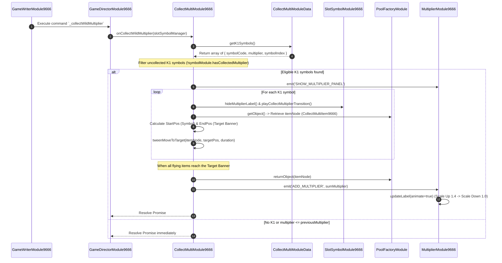

# 🎯 Red Cliff (g9666) Multiplier Badge Display & Collection System

<!-- convention-summary-start -->
### Red Cliff (g9666) Multiplier Badge Display & Collection System Summary

- **Core Architecture / Purpose**: Technical reference, API contract, and integration guide for Red Cliff (g9666) Multiplier Badge Display & Collection System.
- **Key Mechanisms & Design**: Encapsulates core algorithms, event hooks, and performance optimizations within the slot framework runtime.
- **Domain Capabilities**: game_implement, 04_multiplier_subsystem
- **Scope & Code Paths**: `CollectMultiModule9666.ts`
- **Related Docs**: [Master Index](../INDEX.md)
<!-- convention-summary-end -->


---

## 1. Multiplier Collection Subsystem Architecture

The primary orchestration module is **`CollectMultiModule9666`** (working in conjunction with `CollectMultiModuleData` and `CollectMultiItem9666`).

### Key Components:
- **`CollectMultiModuleData`**: Extracts the active list of `K1` symbols on the matrix (`getK1Symbols()`), taking Mega Symbols formatting into account.
- **`CollectMultiModule9666`**: Coordinates the flight trajectory from the symbol position on the table to the Target Banner (Global Multiplier UI on HUD).
- **`itemPool` (`PoolFactoryModule`)**: Manages object pooling for floating particle nodes (`CollectMultiItem9666`).
- **`SpeedDecorator`**: Dynamically scales flight duration when Fast / Turbo Mode is active (`speed = 2` or `3`).

---

## 2. Sequence Diagram: Standard Multiplier Collection Flow



---

## 3. Base Multiplier Subtraction Formula

In `onItemMoveComplete()` of `CollectMultiModule9666.ts`:

```typescript
private onItemMoveComplete(onComplete: () => void, completedCount: number, totalCount: number, collectedSymbols: any[]): void {
    if (completedCount >= totalCount) {
        this._isCollecting = false;

        let sumMultiplier = 0;
        for (const k1 of collectedSymbols) {
            sumMultiplier += k1.multiplier;
        }

        // NOTE: In Normal Game when initial multiplier is at base x1, 
        // subtract 1 to prevent double-counting the initial base multiplier.
        if (this.dataStore.currentGameMode === GAME_MODE_ENUM.NORMAL_GAME && this.getCurrentMultiplier() === 1) {
            sumMultiplier -= 1;
        }

        if (sumMultiplier > 0) {
            this.eventManager.emit('ADD_MULTIPLIER', sumMultiplier);
        }

        this.updateTotalMultiplier();
        onComplete();
    }
}
```

---

## 4. Fast & Turbo Mode Handling

Using `SpeedDecorator` to dynamically shorten animation duration (`COLLECT_MULTI_DURATION / this.speed`):
- When the user presses Fast Stop mid-flight: The `TABLE_FAST_STOP` event is captured by `onFastToResultTriggered()` to instantly update the speed of all active `cc.speed` actions.
