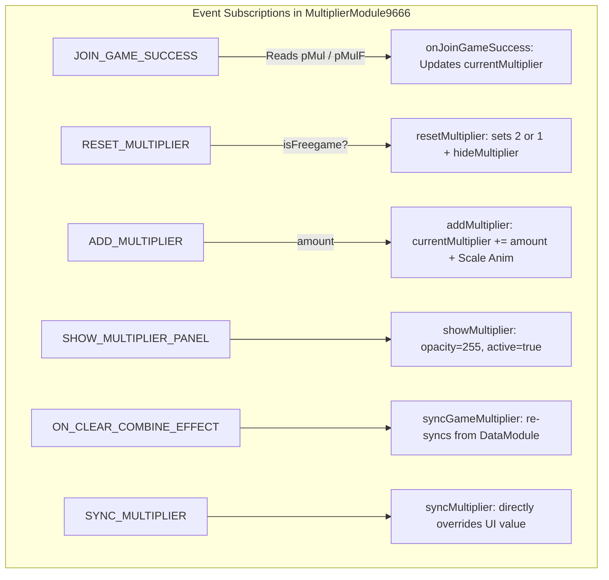

# 📊 Red Cliff (g9666) Global Multiplier UI & Synchronization

<!-- convention-summary-start -->
### Red Cliff (g9666) Global Multiplier UI & Synchronization Summary

- **Core Architecture / Purpose**: Technical reference, API contract, and integration guide for Red Cliff (g9666) Global Multiplier UI & Synchronization.
- **Key Mechanisms & Design**: Encapsulates core algorithms, event hooks, and performance optimizations within the slot framework runtime.
- **Domain Capabilities**: game_implement, 04_multiplier_subsystem
- **Scope & Code Paths**: `MultiplierModule9666.ts`, `MultiplierData9666.ts`, `GameDataStore9666.ts`
- **Related Docs**: [Master Index](../INDEX.md)
<!-- convention-summary-end -->


---

## 1. Module Structure & Components

The Global Multiplier Banner subsystem consists of two key components:
- **`MultiplierModule9666.ts`**: Renders HUD UI text (`lbMultiplier`, formatted as `x2`, `x8`, `x10`...), manages Scale Up/Down impact animations on value updates, and controls Fade In/Out visibility.
- **`MultiplierData9666.ts`**: Registers backend PlaySession keys from `GameDataStore9666`.

### Backend PlaySession Key Mapping (`GameDataStore9666.ts`):
```typescript
mapNewKeys(data, {
    "pMul":  "previousMultiplier",          // Normal Game multiplier prior to collection
    "pMulF": "previousMultiplierFreeGame",  // Free Game multiplier prior to collection
    "mulF":  "freeGameMultiplier",          // Free Game multiplier after collection
    "mul":   "multiplier"                   // Normal Game multiplier after collection
});
```

---

## 2. Base Multipliers by Game Mode

| Game Mode | Base Multiplier | Reset Event Trigger | UI Visibility Rule |
| :--- | :--- | :--- | :--- |
| **Normal Game** | `x1` | `RESET_MULTIPLIER (isFreegame = false)` $\rightarrow$ sets `currentMultiplier = 1` | Hidden while `x1`, shown only when a Multiplier Wild lands (`SHOW_MULTIPLIER_PANEL`) |
| **Free Game** | `x2` | `RESET_MULTIPLIER (isFreegame = true)` $\rightarrow$ sets `currentMultiplier = 2` | Persistently visible and accumulates across Free Spins |

---

## 3. Global Multiplier Event Interaction Graph



---

## 4. UI Scale & Impact Animation

When `updateLabel(animate = true)` is triggered:
```typescript
private playScaleAnimation(): void {
    const node = this.lbMultiplier.node;
    node.stopAllActions();
    node.scale = 1.0;
    const scaleUp = cc.scaleTo(0.15, 1.4);
    const scaleDown = cc.scaleTo(0.15, 1.0);
    const seq = cc.sequence(scaleUp, scaleDown);
    node.runAction(seq);
}
```
This punch-scale effect provides immediate visual feedback at the exact moment a flying particle impacts the Global Banner.
