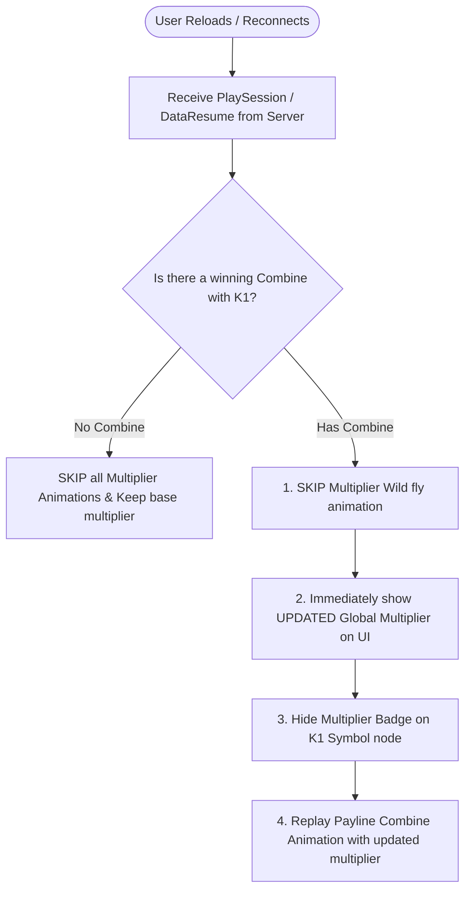

# 🔄 Red Cliff (g9666) Reload & Reconnect Flow for Multiplier Wilds

<!-- convention-summary-start -->
### Red Cliff (g9666) Reload & Reconnect Flow for Multiplier Wilds Summary

- **Core Architecture / Purpose**: Technical reference, API contract, and integration guide for Red Cliff (g9666) Reload & Reconnect Flow for Multiplier Wilds.
- **Key Mechanisms & Design**: Encapsulates core algorithms, event hooks, and performance optimizations within the slot framework runtime.
- **Domain Capabilities**: game_implement, 04_multiplier_subsystem
- **Scope & Code Paths**: `NormalGameWriterModule9666.ts`, `FreeGameWriterModule9666.ts`, `CollectMultiModule9666.ts`
- **Related Docs**: [Master Index](../INDEX.md)
<!-- convention-summary-end -->

---

## 1. Design Specification Matrix

When a player **Reloads (F5) / Reconnects** to the game at the state where:
- Data has been received from the server (Received data).
- The Multiplier Wild animation is currently playing (or about to play).

### Specification Decision Table:

| Condition | Standard Rule (Spec / Docs) | UX Rationale |
| :--- | :--- | :--- |
| **If there is NO combine** | **SKIP Multiplier Animation** | Avoids redundant animations when no winning payline benefits from the multiplier. |
| **If there IS a combine** | **1. SKIP Multiplier WILD Animation** **2. Display updated Global Multiplier UI** *(After adding multiplier from Multiplier WILD)* **3. Replay Combine Animation** | Fast-forwards the Multiplier HUD directly to its post-addition value so the user clearly sees the active multiplier while viewing the replayed winning combine animation. |

---

## 2. Codebase Compliance Audit (Code vs. Spec)

### Detailed Comparison:

| Scenario / Module | Spec Requirement | Current Code Behavior | Status |
| :--- | :--- | :--- | :---: |
| **Normal Game Resume** (`NormalGameWriterModule9666.ts`) | Skip fly animation on reload | In `makeScriptPreResumeGameMode`, command `_collectWildMultiplier` is executed as usual, running full particle tween animations instead of skipping. | ❌ **NON-COMPLIANT** |
| **Free Game Resume** (`FreeGameWriterModule9666.ts`) | Display updated Global Multiplier UI + Replay combine | Command `_collectWildMultiplier` is **commented out** (`// command: "_collectWildMultiplier"`). Consequently, no animation plays, but `MultiplierModule9666` only displays `previousMultiplierFreeGame` (`pMulF`) because `ADD_MULTIPLIER` is never emitted $\rightarrow$ **UI displays outdated multiplier**. | ❌ **NON-COMPLIANT** |
| **K1 Symbol Badge on Reload with Combine** | Hide badge on K1 symbol because it is already added to Global UI | Without a fast-forward synchronization handler on resume, the `x8` badge remains visible on the symbol, causing duplicated text info. | ❌ **NON-COMPLIANT** |

---

## 3. Recommended Implementation Architecture

To achieve 100% compliance with the design specification:

### In `CollectMultiModule9666.ts` / Resume Handlers:
When `isResume === true`:
- **If `hasCombine`**:
  1. Do NOT execute the flying Tween `collectSymbols` (SKIP Anim).
  2. Instantly hide all `K1` symbol multiplier labels via `hideMultiplierLabel()`.
  3. Emit `SYNC_MULTIPLIER` with the target value `freeGameMultiplier || multiplier`.
  4. Ensure `MultiplierModule9666` renders the updated multiplier label before `_showAllPaylines` starts the combine win playback.
- **If `!hasCombine`**:
  1. Skip completely and retain the base multiplier.
