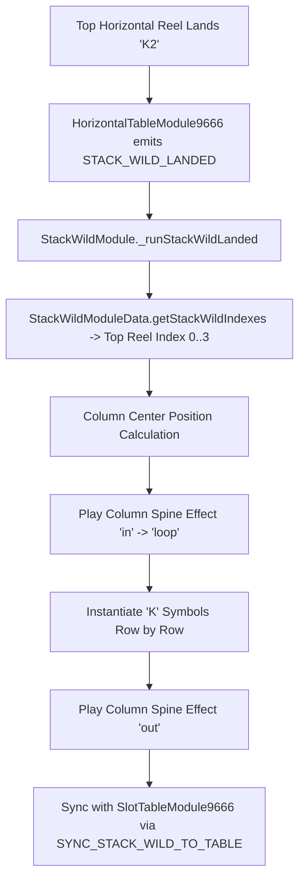

# 🌲 Red Cliff (g9666) Stack Wild Subsystem Architecture & Data Model

<!-- convention-summary-start -->
### Red Cliff (g9666) Stack Wild Subsystem Architecture & Data Model Summary

- **Core Architecture / Purpose**: Technical reference, API contract, and integration guide for Red Cliff (g9666) Stack Wild Subsystem Architecture & Data Model.
- **Key Mechanisms & Design**: Encapsulates core algorithms, event hooks, and performance optimizations within the slot framework runtime.
- **Domain Capabilities**: game_implement, 05_stack_wild_subsystem
- **Scope & Code Paths**: `../../../../assets/cc-release-slot/cc1-red-cliff/scripts/Table/StackWildModule.ts`, `../../../../assets/cc-release-slot/cc1-red-cliff/scripts/Table/StackWildModuleData.ts`, `../../../../assets/cc-release-slot/cc1-red-cliff/scripts/Table/StackWildModuleConfig.ts`
- **Related Docs**: [Master Index](../INDEX.md)
<!-- convention-summary-end -->

---

## 1. Subsystem Overview & Symbol Code `K2`

In Red Cliff (`g9666`), the **Stack Wild** (Expanding Wild) is represented by symbol code **`K2`**:
- **Trigger Location**: Only appears on the Top Horizontal Reel (columns 2, 3, 4, 5).
- **Core Mechanism**: When `K2` lands on top reel index $i \in [0, 1, 2, 3]$, it triggers a full-column vertical expansion covering all rows of the corresponding main vertical reel ($i + 1 \in [1, 2, 3, 4]$) with Wild symbols (`K`).

---

## 2. Key Component Breakdown

| Component | Source File | Responsibilities |
| :--- | :--- | :--- |
| **`StackWildModule`** | [`StackWildModule.ts`](../../../../assets/cc-release-slot/cc1-red-cliff/scripts/Table/StackWildModule.ts) | Main controller managing lifecycle, Spine column animations, row reveal pacing, and sync events. |
| **`StackWildModuleData`** | [`StackWildModuleData.ts`](../../../../assets/cc-release-slot/cc1-red-cliff/scripts/Table/StackWildModuleData.ts) | Maps top reel indices to main table columns, calculates symbol coordinate bounds and center points. |
| **`StackWildModuleConfig`** | [`StackWildModuleConfig.ts`](../../../../assets/cc-release-slot/cc1-red-cliff/scripts/Table/StackWildModuleConfig.ts) | Timing parameters (`STACK_WILD_DELAY`, `STACK_WILD_DURATION`, Turbo multipliers). |
