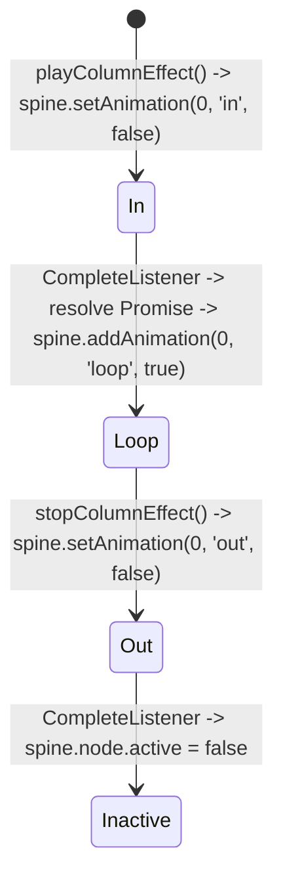

# 🎆 Red Cliff (g9666) Stack Wild Column Expansion & Spine Effects

<!-- convention-summary-start -->
### Red Cliff (g9666) Stack Wild Column Expansion & Spine Effects Summary

- **Core Architecture / Purpose**: Technical reference, API contract, and integration guide for Red Cliff (g9666) Stack Wild Column Expansion & Spine Effects.
- **Key Mechanisms & Design**: Encapsulates core algorithms, event hooks, and performance optimizations within the slot framework runtime.
- **Domain Capabilities**: game_implement, 05_stack_wild_subsystem
- **Scope & Code Paths**: `assets/cc-common/`
- **Related Docs**: [Master Index](../INDEX.md)
<!-- convention-summary-end -->


---

## 1. Column Effect Spine Template Lifecycle

The expansion animation uses an instantiated template `columnEffectTemplate` (`sp.Skeleton`) parented to `symbolLayer`:



---

## 2. Row-by-Row Reveal Loop & Sibling Layering

When spawning Wild symbols down the column, newly created nodes get added to `symbolLayer`. To prevent new symbols from rendering over the active column flame Spine effect, `StackWildModule` re-raises the Spine instance after every row:

```typescript
for (let row = 0; row < maxRows; row++) {
    for (const topTableReelIndex of stackReelIndexes) {
        const mainTableReelIndex = this.data.getMainTableReelIndexByTopTableReelIndex(topTableReelIndex);
        const symbolPositions = this.data.getPositionByReelIndex(mainTableReelIndex);

        if (row < symbolPositions.length) {
            const pos = symbolPositions[row];
            const symbolNode = this.symbolManager.createSymbol('STACK_WILD', new cc.Vec2(1, 1), this.symbolLayer, 'STACK_WILD');
            if (!symbolNode) continue;
            
            symbolNode.setPosition(pos);
            symbolNode.emit('CHANGE_TO_SYMBOL', 'K');
            symbolNode.emit('PLAY_ANIMATION_APPEAR');

            let nodes = this._stackWildReels.get(mainTableReelIndex);
            if (!nodes) {
                nodes = [];
                this._stackWildReels.set(mainTableReelIndex, nodes);
            }
            nodes.push(symbolNode);
        }
    }

    // CRITICAL: Keep column Spine effect above newly spawned symbols
    this.raiseColumnEffectsToTop(stackReelIndexes);

    if (row < maxRows - 1) {
        const checkFast = this._isSkipped || this.gameSettings.isFastToResult;
        if (!checkFast) {
            const currentDelay = this.gameSettings.isTurboActive
                ? (this.config.STACK_WILD_DELAY_TURBO)
                : (this.config.STACK_WILD_DELAY);
            await this.sleep(currentDelay);
        }
    }
}
```

---

## 3. Fast-to-Result & Turbo Mode Adaptations

- **Fast-to-Result (`isFastToResult`)**: Bypasses `symbolNode.emit('PLAY_ANIMATION', 'trigger')` on top reel, triggers all column effects in parallel, and eliminates sleep pauses between rows (`duration = 0`).
- **Turbo Mode (`isTurboActive`)**: Shortens delays to `STACK_WILD_DELAY_TURBO` and duration to `STACK_WILD_DURATION_TURBO`.
