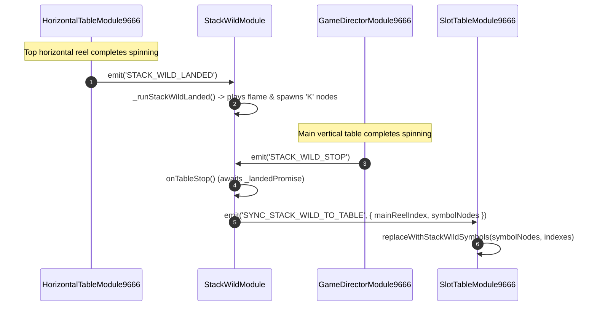

# 🔄 Red Cliff (g9666) Stack Wild Synchronization & Event Bus

<!-- convention-summary-start -->
### Red Cliff (g9666) Stack Wild Synchronization & Event Bus Summary

- **Core Architecture / Purpose**: Technical reference, API contract, and integration guide for Red Cliff (g9666) Stack Wild Synchronization & Event Bus.
- **Key Mechanisms & Design**: Encapsulates core algorithms, event hooks, and performance optimizations within the slot framework runtime.
- **Domain Capabilities**: game_implement, 05_stack_wild_subsystem
- **Scope & Code Paths**: `assets/cc-common/`
- **Related Docs**: [Master Index](../INDEX.md)
<!-- convention-summary-end -->

---

## 1. Event Map & Interaction Sequence

---

## 2. Event Specification

| Event Name | Bus | Sender | Receiver | Payload | Purpose |
| :--- | :--- | :--- | :--- | :--- | :--- |
| **`STACK_WILD_LANDED`** | `moduleEvent` | `HorizontalTableModule9666` / `CompositeCascade9666` | `StackWildModule` | `None` | Signals top reel or cascade refill has stopped; initiates column flame and symbol expansion. |
| **`STACK_WILD_STOP`** | `moduleEvent` | `GameDirectorModule9666` | `StackWildModule` | `None` | Signals main table has stopped; triggers final node synchronization. |
| **`SYNC_STACK_WILD_TO_TABLE`** | `moduleEvent` | `StackWildModule` | `SlotTableModule9666` | `{ mainReelIndex, symbolNodes }` | Hands over created Stack Wild nodes to replace original column symbol slots. |
| **`PLAY_MC_STATE`** | `eventManager` | `StackWildModule` | `SpineMcStateController9666` | `SpineStateMc9666.Expand` | Plays the expansion character reaction / camera animation. |
