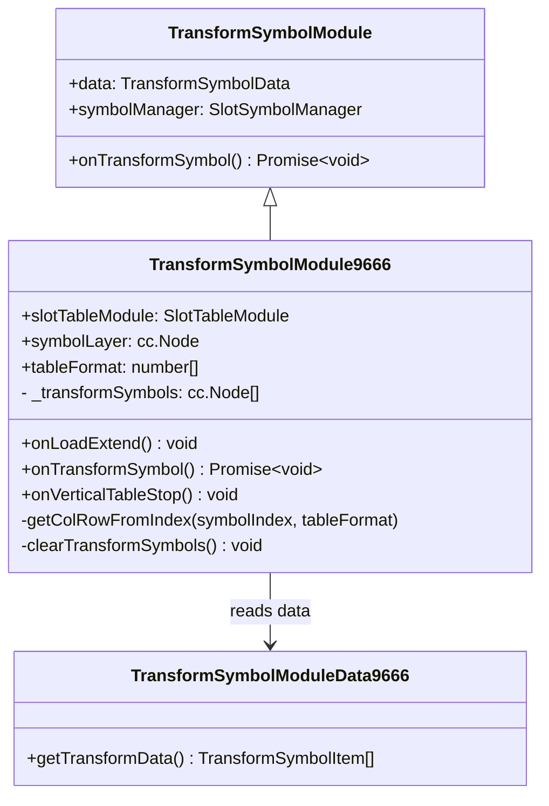

# 🌾 Red Cliff (g9666) Transform Symbol Architecture & Node Pooling

<!-- convention-summary-start -->
### Red Cliff (g9666) Transform Symbol Architecture & Node Pooling Summary

- **Core Architecture / Purpose**: Detailed technical reference for the Transform Symbol subsystem in Red Cliff (g9666), responsible for dynamically morphing symbols into Grass Boat Wilds (`K`).
- **Key Mechanisms & Design**: Dynamically instantiates symbol instances from `SlotSymbolManager9666`, marks `SymbolOwnerType.TRANSFORM_SYMBOL`, calculates grid overlay positions based on `tableFormat [4, 5, 5, 5, 5, 4]`, and tracks lifecycle cleanup.
- **Domain Capabilities**: game_implement, 05_transform_symbol_subsystem
- **Scope & Code Paths**: `assets/cc-release-slot/cc1-red-cliff/scripts/Table/TransformSymbolModule9666 .ts`
- **Related Docs**: [00_ALL_GAME_FEATURES_DEEP_DIVE.md](../00_ALL_GAME_FEATURES_DEEP_DIVE.md), [02_trigger_and_animation_flow.md](./02_trigger_and_animation_flow.md)
<!-- convention-summary-end -->

---

## 1. Subsystem Purpose & Theme

In the Red Cliff story, the famous stratagem **"Thuyền Cỏ Mượn Tên" (Grass Boats Borrowing Arrows)** represents deception and transformation. In game 9666:
- Special symbols selected by the backend server morph into **Wild Thuyền Cỏ (`K`)**.
- Unlike standard slot games that mutate existing symbol components in-place, `TransformSymbolModule9666` utilizes an **overlay architecture** to maintain smooth transition effects and animation independence from cascading reels.

---

## 2. Component Class Diagram & Dependencies



---

## 3. Dynamic Node Pooling & Coordinate Conversion

### 3.1 Why Overlay Instead of In-Place Mutation?
In standard vertical cascading reels, mutating a symbol node in-place can cause race conditions if the reel drops mid-animation. Red Cliff overcomes this by:
1. Identifying the slot cell via `slotTableModule.getSymbolByColRow(col, row)`.
2. Retrieving symbol dimensions (`slotCmp.size`).
3. Instantiating a new overlay symbol from the pool:
   ```typescript
   const transformNode = this.symbolManager.getSymbolFromPool();
   const transformSymbol = SlotSymbolModule.getModuleComponent(transformNode);
   transformSymbol.owner = SymbolOwnerType.TRANSFORM_SYMBOL;
   ```
4. Placing `transformNode` onto `symbolLayer` directly above the existing cell:
   ```typescript
   const worldPos = slotNode.parent.convertToWorldSpaceAR(slotNode.position);
   const localPos = this.symbolLayer.convertToNodeSpaceAR(worldPos);
   transformNode.position = localPos;
   ```
5. Configuring the node as Wild `K` and executing the morph animation.

### 3.2 Matrix Index to (Col, Row) Resolution
Because the logical grid has format `[4, 5, 5, 5, 5, 4]` (spanning both vertical columns and the top sub-reel), converting a linear 1D matrix index into `(col, row)` coordinates requires format-aware calculation:

```typescript
private getColRowFromIndex(symbolIndex: number, tableFormat: number[]): { col: number, row: number } {
    let accumulated = 0;
    for (let col = 0; col < tableFormat.length; col++) {
        const rowCount = tableFormat[col];
        if (symbolIndex < accumulated + rowCount) {
            return { col, row: symbolIndex - accumulated };
        }
        accumulated += rowCount;
    }
    return { col: 0, row: 0 };
}
```
