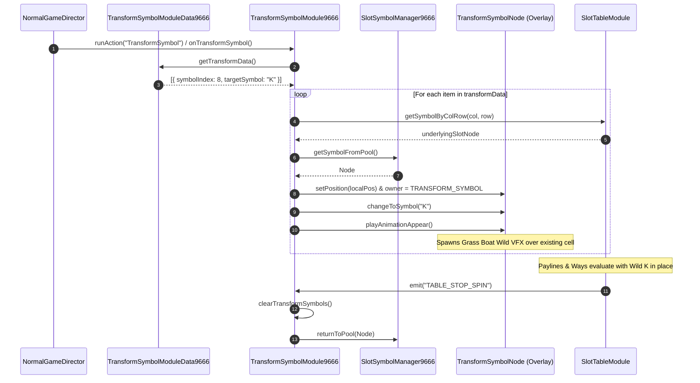

# 🎬 Red Cliff (g9666) Transform Symbol Animation & Lifecycle Flow

<!-- convention-summary-start -->
### Red Cliff (g9666) Transform Symbol Animation & Lifecycle Flow Summary

- **Core Architecture / Purpose**: Step-by-step sequencing of server trigger parsing, morphing animation playback, payline integration, and pool return.
- **Key Mechanisms & Design**: Coordinates `onTransformSymbol()`, `changeToSymbol('K')`, `playAnimationAppear()`, and cleanup on `TABLE_STOP_SPIN`.
- **Domain Capabilities**: game_implement, 05_transform_symbol_subsystem
- **Scope & Code Paths**: `assets/cc-release-slot/cc1-red-cliff/scripts/Table/TransformSymbolModule9666 .ts`
- **Related Docs**: [01_transform_architecture_and_pool.md](./01_transform_architecture_and_pool.md)
<!-- convention-summary-end -->

---

## 1. Sequence Execution Diagram

---

## 2. Event Lifecycle & Step Breakdown

1. **Trigger Condition**:
   - During respin / cascade evaluation, server payload supplies `transformSymbols` indices.
   - `NormalGameDirectorModule9666` or `CompositeCascade9666` calls `onTransformSymbol()`.
2. **Visual Transformation**:
   - The overlay symbol plays `appear` animation with particle trail.
   - The underlying standard symbol is hidden or darkened while the Wild `K` occupies the cell.
3. **Payline Integration**:
   - The slot engine includes the Wild `K` in AllWays matching combinations.
4. **Cleanup & Synchronization**:
   - When `TABLE_STOP_SPIN` fires, all active overlay nodes in `_transformSymbols` are returned to the pool and cleared to prevent memory leaks or ghost symbols.
