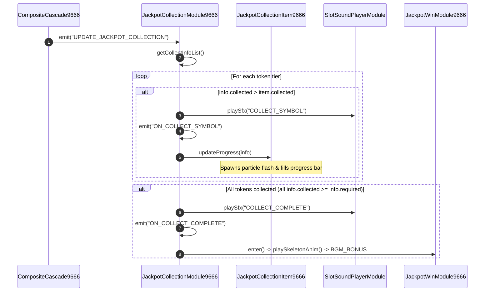

# 🎯 Red Cliff (g9666) Jackpot Token Meter UI & Fly-In Particles

<!-- convention-summary-start -->
### Red Cliff (g9666) Jackpot Token Meter UI Summary

- **Core Architecture / Purpose**: Interactive UI specification for the 4-tier token meters, particle fly-in animations from winning symbols, progress updates, and SFX dispatching.
- **Key Mechanisms & Design**: Covers `JackpotCollectionItem9666.ts`, `UPDATE_JACKPOT_COLLECTION` event handling, SFX `COLLECT_SYMBOL` and `COLLECT_COMPLETE`.
- **Domain Capabilities**: game_implement, 06_jackpot_collection
- **Scope & Code Paths**: `assets/cc-release-slot/cc1-red-cliff/scripts/Gui/JackpotCollectionModule9666.ts`, `assets/cc-release-slot/cc1-red-cliff/scripts/Gui/JackpotCollectionItem9666.ts`
- **Related Docs**: [01_tier_architecture_and_thresholds.md](./01_tier_architecture_and_thresholds.md), [03_smart_resume_deduction_math.md](./03_smart_resume_deduction_math.md)
<!-- convention-summary-end -->

---

## 1. Sequence Execution Diagram

---

## 2. Token Meter Component Details

In [`JackpotCollectionItem9666.ts`](file:///c:/Users/ADMIN/lamnino/cc20-new-all-in-one/assets/cc-release-slot/cc1-red-cliff/scripts/Gui/JackpotCollectionItem9666.ts):
- **Visual Nodes**:
  - `heroIcon`: Displays the hero avatar portrait (Zhao Yun, Zhang Fei, Liu Bei, Guan Yu).
  - `progressBar`: Dynamic fill ratio representing `collected / required`.
  - `progressLabel`: String formatted as `${collected}/${required}` (e.g. `12/15`).
- **Completion Effect**:
  - When `collected >= required`, the progress bar triggers a golden pulse animation and unlocks the jackpot reward.
