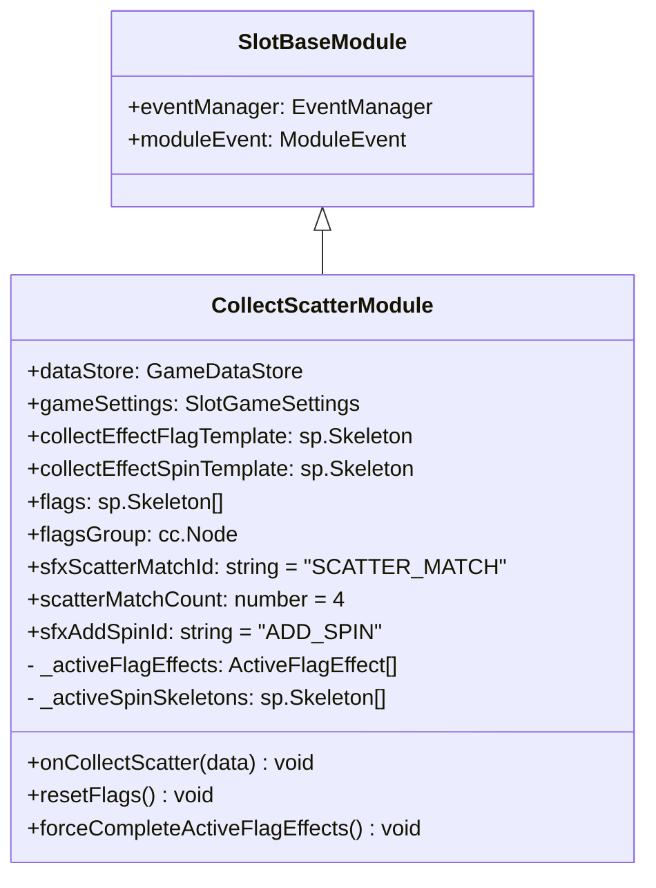
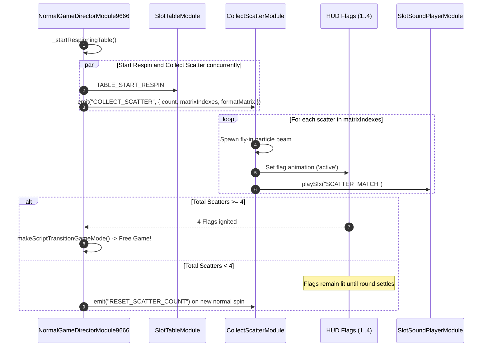

# 🚩 Red Cliff (g9666) Scatter Flag Collection Mechanics

<!-- convention-summary-start -->
### Red Cliff (g9666) Scatter Flag Collection Mechanics Summary

- **Core Architecture / Purpose**: Architectural and mechanical specification of the War Flag Scatter collection subsystem in Red Cliff (g9666).
- **Key Mechanisms & Design**: Details `CollectScatterModule.ts`, 4-flag HUD meter, particle trajectories from Scatter symbol `A` to flags, and transition triggers.
- **Domain Capabilities**: game_implement, 06_scatter_and_free_game
- **Scope & Code Paths**: `assets/cc-release-slot/cc1-red-cliff/scripts/Gui/CollectScatterModule.ts`
- **Related Docs**: [02_free_game_rules_and_extra_spins.md](./02_free_game_rules_and_extra_spins.md), [00_ALL_GAME_FEATURES_DEEP_DIVE.md](../00_ALL_GAME_FEATURES_DEEP_DIVE.md)
<!-- convention-summary-end -->

---

## 1. Feature Overview & Thematic Narrative

In the Battle of Red Cliff (Đại Chiến Xích Bích), signaling flags command the naval fleet. In Game 9666:
- The **Scatter Symbol** (`A`) depicts the Warship / Flag.
- When Scatters appear on the reels during Normal Game, they ignite signaling flags positioned on the HUD.
- Collecting **4 Scatters** fully ignites all 4 battle flags, commanding the fleet to enter the **Free Game** naval battle.

---

## 2. Component Class Diagram & Properties



---

## 3. Flag Collection Sequence & Timing



### 3.1 Parallel Execution with Cascade
In [`NormalGameDirectorModule9666.ts`](file:///c:/Users/ADMIN/lamnino/cc20-new-all-in-one/assets/cc-release-slot/cc1-red-cliff/scripts/GameMode/NormalGameDirectorModule9666.ts):
```typescript
override async _startRespinningTable(data: any): Promise<void> {
    await Promise.all([
        this.moduleEvent.emit("TABLE_START_RESPIN", data),
        this._collectScatter(),
    ]);
}
```
Firing `COLLECT_SCATTER` simultaneously with `TABLE_START_RESPIN` guarantees that the scatter symbols visually dematerialize into flying light beams at the exact frame the winning symbols explode.
