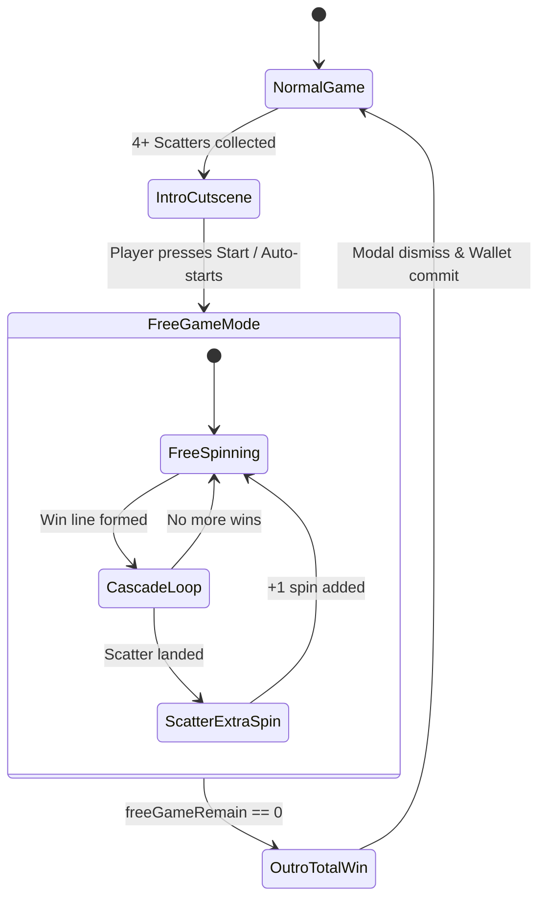

# 🎬 Red Cliff (g9666) Free Game Cutscenes & Total Win Flow

<!-- convention-summary-start -->
### Red Cliff (g9666) Free Game Cutscenes & Total Win Flow Summary

- **Core Architecture / Purpose**: State transitions between Normal Game and Free Game, Cutscenes presentation, Total Win summary modal, and reconnection resilience.
- **Key Mechanisms & Design**: Covers `IntroFreeGameModule9666.ts`, `TotalWinModule9666.ts`, `_resumeFreeTable()`, and smart spin count deduction on join.
- **Domain Capabilities**: game_implement, 06_scatter_and_free_game
- **Scope & Code Paths**: `assets/cc-release-slot/cc1-red-cliff/scripts/Cutscene/IntroFreeGameModule9666.ts`, `assets/cc-release-slot/cc1-red-cliff/scripts/Cutscene/TotalWinModule9666.ts`
- **Related Docs**: [02_free_game_rules_and_extra_spins.md](./02_free_game_rules_and_extra_spins.md)
<!-- convention-summary-end -->

---

## 1. Transition Flow Architecture



---

## 2. Free Game Intro & Outro Modules

### 2.1 Intro Free Game (`IntroFreeGameModule9666.ts`)
- Plays cinematic Spine opening: Naval battle fleet sailing towards the Red Cliffs.
- Displays awarded Free Spin count (7, 8, or 9).
- Plays transition SFX and shifts BGM to `BGM_FREEGAME`.

### 2.2 Total Win Presentation (`TotalWinModule9666.ts`)
- Displays cumulative win amount across all free spins.
- Numeric rolling count-up with sound loops (`COUNTING` $\rightarrow$ `COUNTING_STOP`).
- Dismisses back to Normal Game mode, reenabling the normal spin button and reinitializing the normal bet panel.

---

## 3. Reconnect & Resume Deductions

If a network disconnection or page reload occurs during a Free Game round:
1. `FreeGameDirectorModule9666.syncSpinTimes()` executes:
   ```typescript
   if (isResume) {
       const rawMatrix = this.dataStore.playSession.respinGameMatrix
           || this.dataStore.playSession.freeGameMatrix
           || this.dataStore.playSession.matrix || [];
       const scatterCount = rawMatrix.filter((s) => s === 'A').length;
       total = Math.max(0, total - scatterCount);
   }
   ```
2. Deducting already-awarded Scatter extra spins prevents the UI spin counter from double-counting when the reconnection animation plays out.
