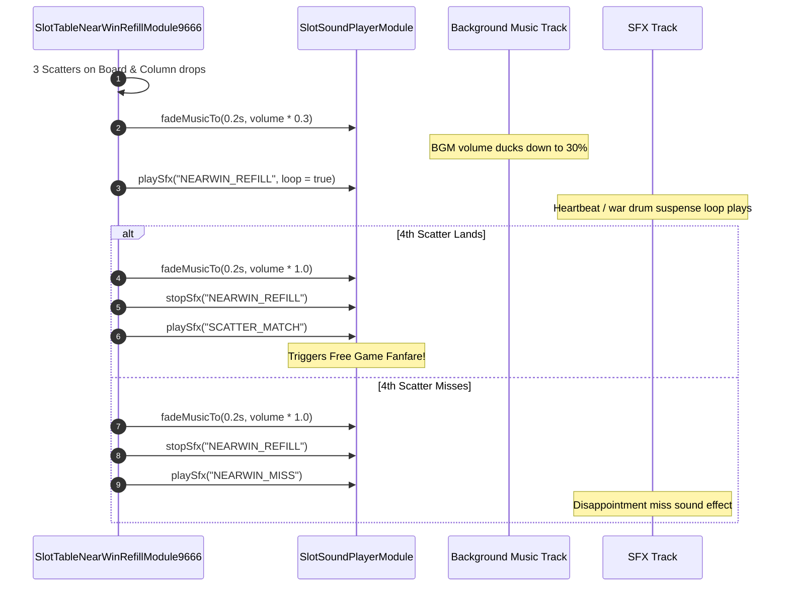

# 🎵 Red Cliff (g9666) Audio Ducking & Suspense Audio Architecture

<!-- convention-summary-start -->
### Red Cliff (g9666) Audio Ducking & Suspense Audio Summary

- **Core Architecture / Purpose**: Detailed analysis of real-time audio ducking and SFX dispatching during near-win suspense states.
- **Key Mechanisms & Design**: Covers `bgmDuckVolumeRatio = 0.3`, `bgmDuckFadeTime = 0.2`, `soundNearWinId = "NEARWIN_REFILL"`, and `sfxNearWinMissId = "NEARWIN_MISS"`.
- **Domain Capabilities**: game_implement, 07_anticipation_and_near_win
- **Scope & Code Paths**: `assets/cc-release-slot/cc1-red-cliff/scripts/Table/SlotTableNearWinRefillModule9666.ts`
- **Related Docs**: [01_near_win_refill_mechanics.md](./01_near_win_refill_mechanics.md)
<!-- convention-summary-end -->

---

## 1. Audio Ducking Flowchart

---

## 2. Audio Ducking Parameters & Tuning

From [`SlotTableNearWinRefillModule9666.ts`](file:///c:/Users/ADMIN/lamnino/cc20-new-all-in-one/assets/cc-release-slot/cc1-red-cliff/scripts/Table/SlotTableNearWinRefillModule9666.ts):
- **`bgmDuckVolumeRatio: 0.3`**: Drops BGM to exactly 30% of user-configured volume to give the suspense SFX maximum acoustic prominence.
- **`bgmDuckFadeTime: 0.2`**: Smooth 200ms linear fade in/out preventing audio pops.
- **`sfxNearWinMissId: "NEARWIN_MISS"`**: Played if the final scatter count remains $< 4$.
