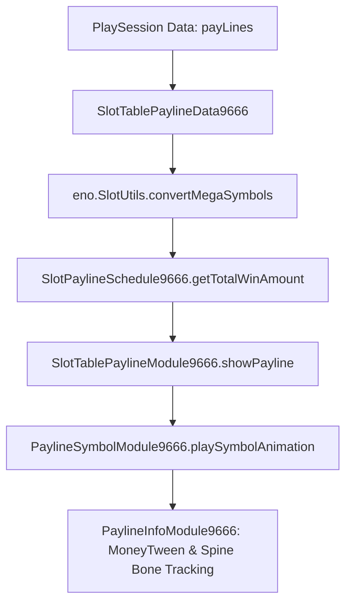

# 🎯 Red Cliff (g9666) Payline Subsystem Architecture & 243 AllWays Rules

<!-- convention-summary-start -->
### Red Cliff (g9666) Payline Subsystem Architecture & 243 AllWays Rules Summary

- **Core Architecture / Purpose**: Technical reference, API contract, and integration guide for Red Cliff (g9666) Payline Subsystem Architecture & 243 AllWays Rules.
- **Key Mechanisms & Design**: Encapsulates core algorithms, event hooks, and performance optimizations within the slot framework runtime.
- **Domain Capabilities**: game_implement, 07_payline_and_spine_sync
- **Scope & Code Paths**: `../../../../assets/cc-release-slot/cc1-red-cliff/scripts/Payline/SlotTablePaylineModule9666.ts`, `../../../../assets/cc-release-slot/cc1-red-cliff/scripts/Payline/SlotTablePaylineData9666.ts`, `../../../../assets/cc-release-slot/cc1-red-cliff/scripts/Payline/SlotPaylineSchedule9666.ts`
- **Related Docs**: [Master Index](../INDEX.md)
<!-- convention-summary-end -->


---

## 1. Payline Model Overview (243 AllWays)

Red Cliff 9666 implements an **AllWays (243 Ways to Win)** payline evaluation model:
- Adjacent symbols landing on consecutive reels from leftmost (Reel 1) to right.
- **Components Involved**:
  - [`SlotTablePaylineModule9666`](../../../../assets/cc-release-slot/cc1-red-cliff/scripts/Payline/SlotTablePaylineModule9666.ts): Main payline presentation orchestrator.
  - [`SlotTablePaylineData9666`](../../../../assets/cc-release-slot/cc1-red-cliff/scripts/Payline/SlotTablePaylineData9666.ts): Converts raw matrix with Mega symbols into payline grid coordinates.
  - [`SlotPaylineSchedule9666`](../../../../assets/cc-release-slot/cc1-red-cliff/scripts/Payline/SlotPaylineSchedule9666.ts): Schedules sequential or blinking payline presentations.
  - [`PaylineSymbolModule9666`](../../../../assets/cc-release-slot/cc1-red-cliff/scripts/Payline/PaylineSymbolModule9666.ts): Controls winning symbol highlights and combine effects.



---

## 2. Base Win vs. Multiplied Win Calculation

In `SlotPaylineSchedule9666.ts`, base winning amounts before multiplier application are computed via:

```typescript
protected getTotalWinAmount(paylines: any[]): number {
    return paylines.reduce((total, payline) => total + (payline.payLineWinAmount / payline.multiplier), 0);
}
```

This ensures the UI can present the un-multiplied base amount first, followed by the dynamic multiplier application animation in `PaylineInfoModule9666`.
