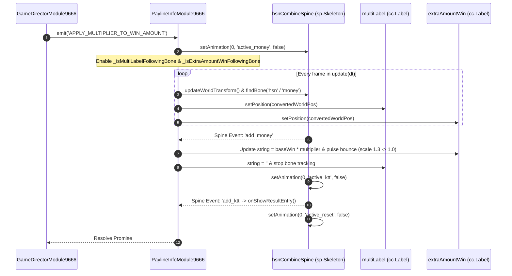

# 🦴 Red Cliff (g9666) Real-Time Spine Bone Tracking ('hsn' & 'money')

<!-- convention-summary-start -->
### Red Cliff (g9666) Real-Time Spine Bone Tracking ( Summary

- **Core Architecture / Purpose**: Technical reference, API contract, and integration guide for Red Cliff (g9666) Real-Time Spine Bone Tracking (.
- **Key Mechanisms & Design**: Encapsulates core algorithms, event hooks, and performance optimizations within the slot framework runtime.
- **Domain Capabilities**: game_implement, 07_payline_and_spine_sync
- **Scope & Code Paths**: `PaylineInfoModule9666.ts`
- **Related Docs**: [Master Index](../INDEX.md)
<!-- convention-summary-end -->


---

## 1. Spine Bone Anchor Architecture

In Red Cliff 9666, the multiplier application effect uses dynamic bone tracking where UI text labels strictly follow animated Spine bones in world space:
- **Spine Skeleton**: `hsnCombineSpine` (`sp.Skeleton`).
- **Bone `'hsn'`**: Tracks the position of `multiLabel` (e.g., `x2`, `x8`).
- **Bone `'money'`**: Tracks the position of `extraAmountWin` (the winning amount text).



---

## 2. Coordinate Space Transformation Implementation

In `PaylineInfoModule9666.ts`:

```typescript
update(_dt: number): void {
    if (this._isMultiLabelFollowingBone) {
        this.syncNodeToBone(this.multiLabel?.node, 'hsn');
    }
    if (this._isExtraAmountWinFollowingBone) {
        this.syncNodeToBone(this.extraAmountWin?.node, 'money');
    }
}

private syncNodeToBone(targetNode: cc.Node, boneName: string): void {
    if (!targetNode || !targetNode.parent || !this.hsnCombineSpine || !this.hsnCombineSpine.skeletonData) {
        return;
    }

    this.hsnCombineSpine.updateWorldTransform();
    const bone = this.hsnCombineSpine.findBone(boneName);
    if (!bone) {
        return;
    }

    // Convert local Spine bone coordinate to World Space, then to targetNode's Parent Space
    const worldPos = this.hsnCombineSpine.node.convertToWorldSpaceAR(cc.v2(bone.worldX, bone.worldY));
    targetNode.setPosition(targetNode.parent.convertToNodeSpaceAR(worldPos));
}
```
