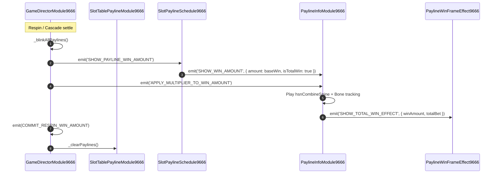

# 🔄 Red Cliff (g9666) Payline Synchronization & Event Pipeline

<!-- convention-summary-start -->
### Red Cliff (g9666) Payline Synchronization & Event Pipeline Summary

- **Core Architecture / Purpose**: Technical reference, API contract, and integration guide for Red Cliff (g9666) Payline Synchronization & Event Pipeline.
- **Key Mechanisms & Design**: Encapsulates core algorithms, event hooks, and performance optimizations within the slot framework runtime.
- **Domain Capabilities**: game_implement, 07_payline_and_spine_sync
- **Scope & Code Paths**: `assets/cc-common/`
- **Related Docs**: [Master Index](../INDEX.md)
<!-- convention-summary-end -->

---

## 1. Payline Presentation Event Sequence

---

## 2. Event Specification

| Event Name | Bus | Sender | Receiver | Payload | Purpose |
| :--- | :--- | :--- | :--- | :--- | :--- |
| **`SHOW_PAYLINE_WIN_AMOUNT`** | `eventManager` | `DirectorModule9666` | `SlotPaylineSchedule9666` | `{ isFirstSpin }` | Prompts calculation of un-multiplied base payline sum. |
| **`SHOW_WIN_AMOUNT`** | `eventManager` | `SlotPaylineSchedule9666` | `PaylineInfoModule9666` | `{ amount, isTotalWin }` | Activates paybar win display. |
| **`APPLY_MULTIPLIER_TO_WIN_AMOUNT`** | `eventManager` | `DirectorModule9666` | `PaylineInfoModule9666` | `boolean` | Triggers Spine bone tracking animation applying multiplier to winning amount. |
| **`SHOW_TOTAL_WIN_EFFECT`** | `eventManager` | `PaylineInfoModule9666` | `PaylineWinFrameEffect9666` | `{ winAmount, totalBet, isResume }` | Switches tiered win frame (Level 1, 2, or 3). |
| **`RESET_TOTAL_WIN_EFFECT`** | `eventManager` | `PaylineInfoModule9666` | `PaylineWinFrameEffect9666` | `None` | Resets win frame back to idle state. |
| **`COMMIT_RESPIN_WIN_AMOUNT`** | `eventManager` | `DirectorModule9666` | `WinAmountModule9666` | `None` | Commits current cascade step's win into player session balance. |
| **`FADE_OUT_RESPIN_WIN_AMOUNT`** | `eventManager` | `DirectorModule9666` | `PaylineInfoModule9666` | `duration` | Smoothly fades out win text prior to next spin. |
