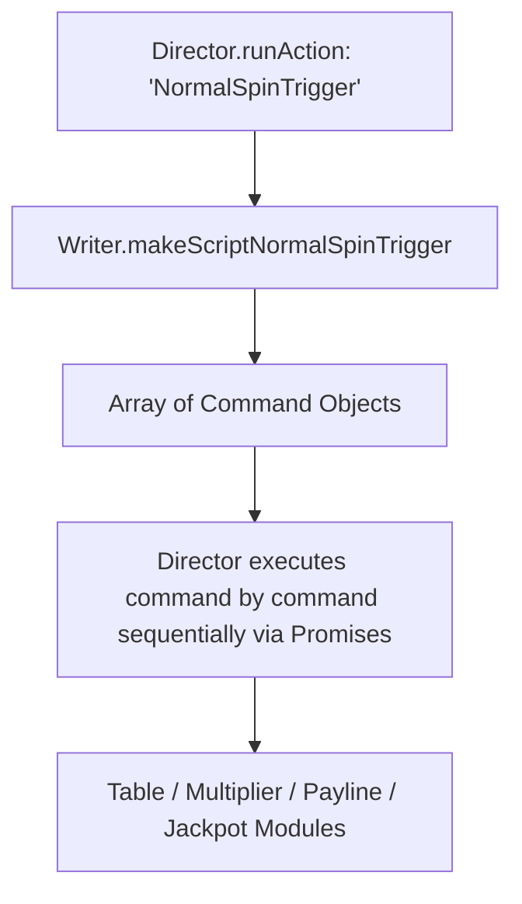

# 🎬 Red Cliff (g9666) Game Directors & Writers Pipeline

<!-- convention-summary-start -->
### Red Cliff (g9666) Game Directors & Writers Pipeline Summary

- **Core Architecture / Purpose**: Technical reference, API contract, and integration guide for Red Cliff (g9666) Game Directors & Writers Pipeline.
- **Key Mechanisms & Design**: Encapsulates core algorithms, event hooks, and performance optimizations within the slot framework runtime.
- **Domain Capabilities**: game_implement, g9666_red_cliff
- **Scope & Code Paths**: `../../../../assets/cc-release-slot/cc1-red-cliff/scripts/GameMode/NormalGameWriterModule9666.ts`, `../../../../assets/cc-release-slot/cc1-red-cliff/scripts/GameMode/FreeGameWriterModule9666.ts`, `../../../../assets/cc-release-slot/cc1-red-cliff/scripts/GameMode/NormalGameDirectorModule9666.ts`
- **Related Docs**: [Master Index](../INDEX.md)
<!-- convention-summary-end -->


---

## 1. Architecture Overview

Red Cliff 9666 follows the **Director-Writer Command Pattern**:
- **Writer Modules** ([`NormalGameWriterModule9666`](../../../../assets/cc-release-slot/cc1-red-cliff/scripts/GameMode/NormalGameWriterModule9666.ts), [`FreeGameWriterModule9666`](../../../../assets/cc-release-slot/cc1-red-cliff/scripts/GameMode/FreeGameWriterModule9666.ts)): Construct ordered arrays of command objects (`{ command: string, data?: any }`) defining the exact animation and logic execution sequence.
- **Director Modules** ([`NormalGameDirectorModule9666`](../../../../assets/cc-release-slot/cc1-red-cliff/scripts/GameMode/NormalGameDirectorModule9666.ts), [`FreeGameDirectorModule9666`](../../../../assets/cc-release-slot/cc1-red-cliff/scripts/GameMode/FreeGameDirectorModule9666.ts)): Execute commands asynchronously, coordinating between Table, Reel, HUD, Payline, and Cutscene modules.



---

## 2. Key Command Pipeline Comparison

| Step / Scenario | Normal Game Sequence (`NormalGameWriterModule9666`) | Free Game Sequence (`FreeGameWriterModule9666`) |
| :--- | :--- | :--- |
| **Pre-Resume / Resume** | `_pauseWallet` $\rightarrow$ `_resumeNormalTable` $\rightarrow$ `_collectWildMultiplier` $\rightarrow$ `_setUpPaylines` $\rightarrow$ `_resumeWinAmount` | `_resumeFreeTable` $\rightarrow$ `_setUpPaylines` $\rightarrow$ `_resumeWinAmount` $\rightarrow$ `_initJackpotCollection` $\rightarrow$ `_showAllPaylines` |
| **Stop Table** | `_stopSpinningTopTable` $\rightarrow$ `_stopSpinningTable` $\rightarrow$ `_syncStackWild` $\rightarrow$ `_collectWildMultiplier` $\rightarrow$ `_setUpPaylines` | `_stopSpinningTopTable` $\rightarrow$ `_stopSpinningTable` $\rightarrow$ `_syncStackWild` $\rightarrow$ `_collectWildMultiplier` $\rightarrow$ `_setUpPaylines` |
| **Stop Respin (Cascade)** | `_showRespinResultEntry` $\rightarrow$ `_stopRespinningTable` $\rightarrow$ `_syncStackWild` $\rightarrow$ `_collectWildMultiplier` $\rightarrow$ `_setUpPaylines` $\rightarrow$ `_showRespinResultFinal` | `_showRespinResultEntry` $\rightarrow$ `_stopRespinningTable` $\rightarrow$ `_syncStackWild` $\rightarrow$ `_collectWildMultiplier` $\rightarrow$ `_setUpPaylines` $\rightarrow$ `_showRespinResultFinal` |

---

## 3. Custom Director Method Overrides

### 1. `_collectScatter()` & Parallel Respin
In both Normal and Free Game Directors, Scatters are collected concurrently with table cascades:
```typescript
override async _startRespinningTable(data: any): Promise<void> {
    await Promise.all([
        this.moduleEvent.emit("TABLE_START_RESPIN", data),
        this._collectScatter(),
    ]);
}
```

### 2. `_showStartRespinEffect()` & Multiplier Application
```typescript
async _showStartRespinEffect(): Promise<void> {
    if (this.dataStore.playSession.payLines || this.dataStore.playSession.freeGamePayLines) {
        this._blinkAllPaylines();
        this._showPaylineAmount(this.dataStore.playSession.respinGameTotal === 1);
        const speed = (this.gameSettings.isFastToResult || this.gameSettings.isTurboActive) ? 2 : 1;
        await this.delayAction(1 / speed);
        await this.eventManager.emit("APPLY_MULTIPLIER_TO_WIN_AMOUNT", this.dataStore.playSession.respinGameTotal === 1);
        this.eventManager.emit(COMMIT_RESPIN_WIN_AMOUNT);
        await this._clearPaylines();
    }
}
```
