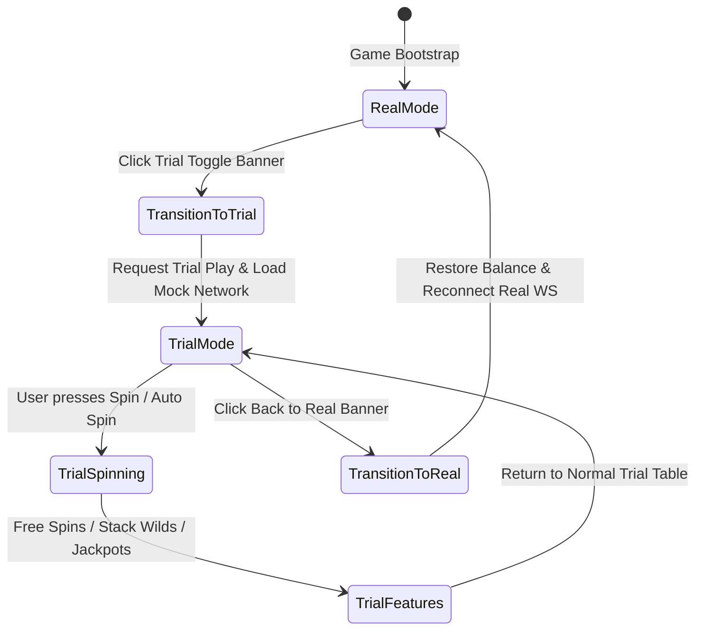

# 🏛️ Red Cliff (g9666) Trial Mode Architecture & Lifecycle

<!-- convention-summary-start -->
### Red Cliff (g9666) Trial Mode Architecture & Lifecycle Summary

- **Core Architecture / Purpose**: Technical reference, API contract, and integration guide for Red Cliff (g9666) Trial Mode Architecture & Lifecycle.
- **Key Mechanisms & Design**: Encapsulates core algorithms, event hooks, and performance optimizations within the slot framework runtime.
- **Domain Capabilities**: game_implement, 09_trial_mode_and_ui_framework
- **Scope & Code Paths**: `../../../../assets/cc-release-slot/cc1-red-cliff/scripts/Gui/TrialModeToggleButton9666.ts`, `../../../../assets/cc-release-slot/cc1-red-cliff/scripts/Gui/TrialModeLoopController9666.ts`, `../../../../assets/cc-release-slot/cc1-red-cliff/scripts/Mock/TutorialMockNetwork9666.ts`
- **Related Docs**: [Master Index](../INDEX.md)
<!-- convention-summary-end -->

---

## 1. Overview & Dual State Model

Red Cliff 9666 provides a seamless **Trial Mode (Chơi Thử)** system designed to allow players to experience features, Free Spins, and Jackpots with zero financial risk while maintaining the exact same visual presentation and gameplay mechanics as Real Mode.

---

## 2. Core Subsystem Component Registry

| Component | File Path | Primary Responsibility |
| :--- | :--- | :--- |
| **`TrialModeToggleButton9666`** | [`TrialModeToggleButton9666.ts`](../../../../assets/cc-release-slot/cc1-red-cliff/scripts/Gui/TrialModeToggleButton9666.ts) | UI toggle button handling banner states, optimistic visual switches, and transition reconciliation. |
| **`TrialModeLoopController9666`** | [`TrialModeLoopController9666.ts`](../../../../assets/cc-release-slot/cc1-red-cliff/scripts/Gui/TrialModeLoopController9666.ts) | Intercepts SDK tutorial sequences to enable free manual trial spinning. |
| **`TutorialMockNetwork9666`** | [`TutorialMockNetwork9666.ts`](../../../../assets/cc-release-slot/cc1-red-cliff/scripts/Mock/TutorialMockNetwork9666.ts) | Local mock network provider servicing trial spin requests offline. |
| **`TutorialMockData9666`** | [`TutorialMockData9666.ts`](../../../../assets/cc-release-slot/cc1-red-cliff/scripts/Mock/TutorialMockData9666.ts) | Structured scenario decks and step sequencer for scripted feature loops. |
| **`UIManagerModule9666`** | [`UIManagerModule9666.ts`](../../../../assets/cc-release-slot/cc1-red-cliff/scripts/Gui/UIManagerModule9666.ts) | Installs and manages the lifecycle of the `TrialModeLoopController9666`. |
