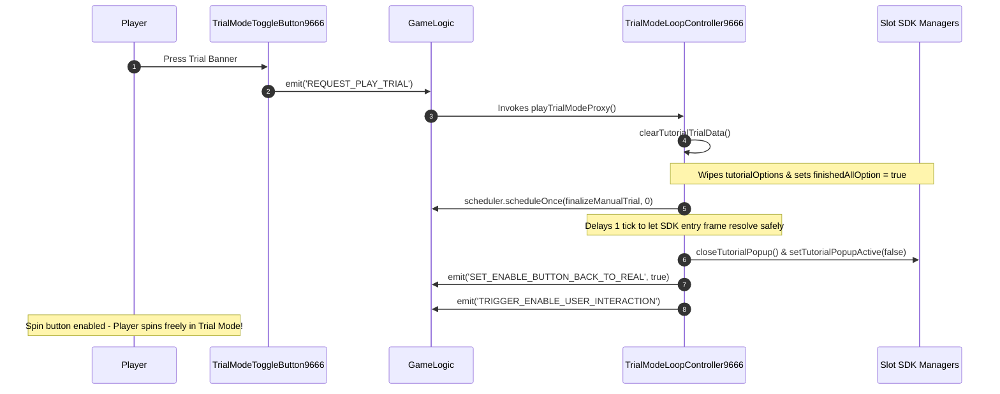

# ⚙️ Red Cliff (g9666) Trial Loop Controller & SDK Tutorial Bypass

<!-- convention-summary-start -->
### Red Cliff (g9666) Trial Loop Controller & SDK Tutorial Bypass Summary

- **Core Architecture / Purpose**: Technical reference, API contract, and integration guide for Red Cliff (g9666) Trial Loop Controller & SDK Tutorial Bypass.
- **Key Mechanisms & Design**: Encapsulates core algorithms, event hooks, and performance optimizations within the slot framework runtime.
- **Domain Capabilities**: game_implement, 09_trial_mode_and_ui_framework
- **Scope & Code Paths**: `assets/cc-common/`
- **Related Docs**: [Master Index](../INDEX.md)
<!-- convention-summary-end -->


---

## 1. The Challenge: SDK Rigid Tutorial Flow

The underlying Cocos Slot SDK default trial mode expects a predefined sequence of fixed tutorial steps with modal dialog popups guiding the user. Red Cliff 9666 requires a **free manual trial spin loop** where the user can press Spin freely without forced popup interruptions.

---

## 2. Solution: `TrialModeLoopController9666` Proxy Pattern

`TrialModeLoopController9666` wraps and replaces `gameLogic.playTrialMode`:



---

## 3. Key Implementation Highlights

```typescript
private finalizeManualTrial(): void {
    if (!this.clearTutorialTrialData()) {
        cc.error("[TrialMode9666] SDK Trial managers are unavailable");
        return;
    }

    const trialModeManager = this.gameLogic.getTrialModeManager && this.gameLogic.getTrialModeManager();
    const trialModeData = trialModeManager && trialModeManager.trialModeData;

    // Suppress SDK tutorial popups while preserving error dialogs
    if (trialModeData && typeof trialModeData.setDisplayPopup === "function") {
        trialModeData.setDisplayPopup(false);
    }
    if (trialModeData && typeof trialModeData.setTutorialPopupActive === "function") {
        trialModeData.setTutorialPopupActive(false);
    }
    if (trialModeManager && typeof trialModeManager.closeTutorialPopup === "function") {
        trialModeManager.closeTutorialPopup();
    }

    const eventManager = this.gameLogic.getEventManager();
    eventManager.emit(SET_ENABLE_BACK_TO_REAL_EVENT, true);
    eventManager.emit(TRIGGER_ENABLE_USER_INTERACTION_EVENT);
}
```
