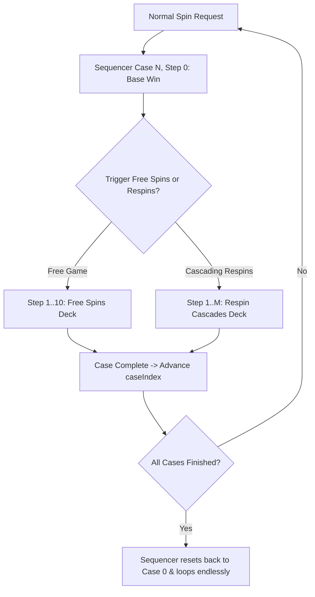

# 🌐 Red Cliff (g9666) Mock Network Provider & Step Sequencer

<!-- convention-summary-start -->
### Red Cliff (g9666) Mock Network Provider & Step Sequencer Summary

- **Core Architecture / Purpose**: Technical reference, API contract, and integration guide for Red Cliff (g9666) Mock Network Provider & Step Sequencer.
- **Key Mechanisms & Design**: Encapsulates core algorithms, event hooks, and performance optimizations within the slot framework runtime.
- **Domain Capabilities**: game_implement, 09_trial_mode_and_ui_framework
- **Scope & Code Paths**: `assets/cc-common/`
- **Related Docs**: [Master Index](../INDEX.md)
<!-- convention-summary-end -->


---

## 1. Mock Request Routing Architecture

When in Trial Mode, requests that would normally be dispatched to the remote WebSocket server are intercepted by `MockRequestRoute9666` and fulfilled locally by `TutorialMockNetwork9666`:

```typescript
export const MOCK_REQUEST_ROUTES_9666: Record<string, MockRequestRoute9666> = {
    'client-normal-game-trial-request': { source: 'tutorial', requestType: 'normal' },
    'ngt': { source: 'tutorial', requestType: 'normal' },
    'client-free-game-trial-request': { source: 'tutorial', requestType: 'free' },
    'fgt': { source: 'tutorial', requestType: 'free' },
    'client-respin-trial-request': { source: 'tutorial', requestType: 'respin' },
    'rst': { source: 'tutorial', requestType: 'respin' },
};
```

---

## 2. Mock Scenario Deck Sequencer (`TutorialMockSequencer9666`)

Mock data is partitioned into structured scenario cases (decks). The sequencer steps through cascades and feature spins deterministically:


