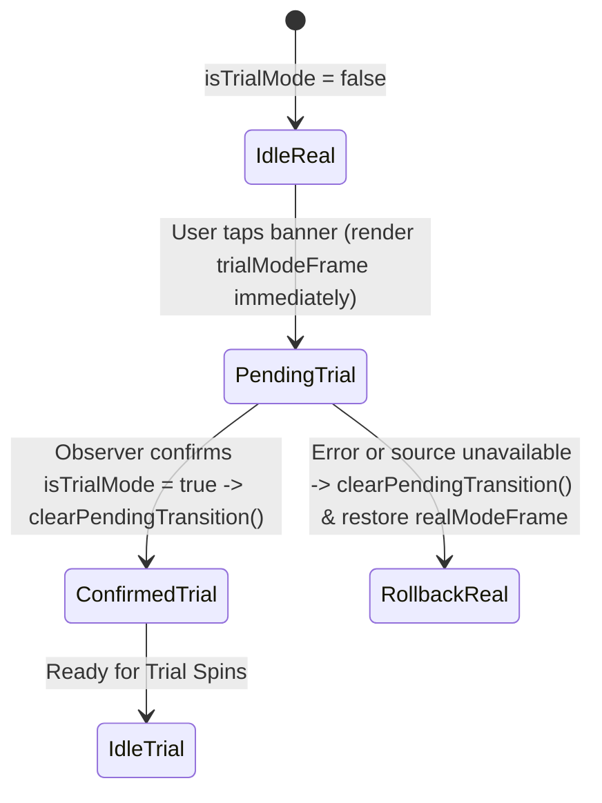

# 🔘 Red Cliff (g9666) Trial Toggle Button & Pending State Reconciliation

<!-- convention-summary-start -->
### Red Cliff (g9666) Trial Toggle Button & Pending State Reconciliation Summary

- **Core Architecture / Purpose**: Technical reference, API contract, and integration guide for Red Cliff (g9666) Trial Toggle Button & Pending State Reconciliation.
- **Key Mechanisms & Design**: Encapsulates core algorithms, event hooks, and performance optimizations within the slot framework runtime.
- **Domain Capabilities**: game_implement, 09_trial_mode_and_ui_framework
- **Scope & Code Paths**: `assets/cc-common/`
- **Related Docs**: [Master Index](../INDEX.md)
<!-- convention-summary-end -->


---

## 1. Optimistic UI & Asynchronous Transition

When a player taps the mode toggle banner, waiting for network response creates perceptible UI lag. `TrialModeToggleButton9666` implements **optimistic rendering** with **state reconciliation**:



---

## 2. Transition Reconciliation Algorithm

```typescript
private reconcilePendingTransition(): void {
    if (this._pendingTrialMode === null) return;

    const targetAvailable = this._pendingTrialMode ? this._canExitTrial : this._canEnterTrial;
    const sourceAvailable = this._pendingTrialMode ? this._canEnterTrial : this._canExitTrial;

    if (!sourceAvailable) {
        this._pendingSourceUnavailable = true;
    }

    if (this._isTrialMode === this._pendingTrialMode) {
        if (targetAvailable) this.clearPendingTransition();
        return;
    }

    const sourceRecovered = this._pendingSourceUnavailable && sourceAvailable;
    const interactionRecovered = this._pendingInteractionDisabled && this._isUserInteractionEnabled;
    if (sourceRecovered || (interactionRecovered && sourceAvailable)) {
        this.clearPendingTransition();
    }
}
```

This guarantees the toggle button never gets permanently stuck in an unresponsive disabled state if a network transition fails or gets canceled midway.
