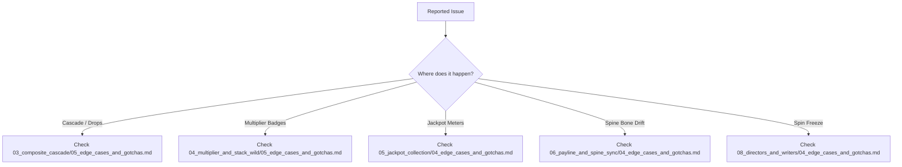

# 🩺 Red Cliff (g9666) Troubleshooting Cookbook & Common Bug Fixes

<!-- convention-summary-start -->
### Red Cliff (g9666) Troubleshooting Cookbook & Common Bug Fixes Summary

- **Core Architecture / Purpose**: Technical reference, API contract, and integration guide for Red Cliff (g9666) Troubleshooting Cookbook & Common Bug Fixes.
- **Key Mechanisms & Design**: Encapsulates core algorithms, event hooks, and performance optimizations within the slot framework runtime.
- **Domain Capabilities**: game_implement, 10_recipes_and_debugging
- **Scope & Code Paths**: `assets/cc-common/`
- **Related Docs**: [Master Index](../INDEX.md)
<!-- convention-summary-end -->

---

## 1. Quick Diagnostic Flowchart

