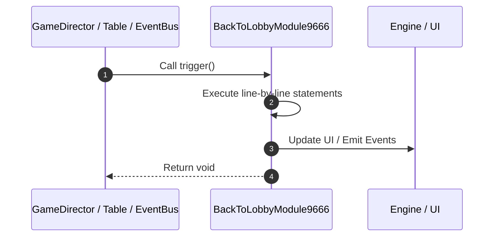

# 📖 `BackToLobbyModule9666.trigger()`

<!-- convention-summary-start -->
### BackToLobbyModule9666.trigger Line-by-Line Method Walkthrough Summary

- **Core Architecture / Purpose**: Technical reference, API contract, and integration guide for BackToLobbyModule9666.trigger Line-by-Line Method Walkthrough.
- **Key Mechanisms & Design**: Encapsulates core algorithms, event hooks, and performance optimizations within the slot framework runtime.
- **Domain Capabilities**: game_implement, 03_methods
- **Scope & Code Paths**: `file:///C:/Users/ADMIN/lamnino/cc20-new-all-in-one/assets/cc-release-slot/cc1-red-cliff/scripts/Gui/BackToLobbyModule9666.ts`
- **Related Docs**: [Master Index](../INDEX.md)
<!-- convention-summary-end -->


---

## 1. Method Signature & Overview

```typescript
public trigger(): void
```

- **Declaring Class**: `BackToLobbyModule9666` ([`BackToLobbyModule9666.ts`](file:///C:/Users/ADMIN/lamnino/cc20-new-all-in-one/assets/cc-release-slot/cc1-red-cliff/scripts/Gui/BackToLobbyModule9666.ts))
- **Source Range**: Lines 11 to 45
- **Execution Cost**: $O(1)$ synchronous logic or timer Promise.

---

## 2. Complete Source Implementation

```typescript
	trigger(): void {
		if (this.soundPlayer) {
			this.soundPlayer.playSFXClick();
		}

		const dialogManager = this.gameLogic.getDialogManager ? this.gameLogic.getDialogManager() : null;
		if (dialogManager) {
			const onConfirm = () => {
				this.gameLogic.emit(GameLogicUIEvents.BACK_TO_LOBBY);

				this._backToLobbyCallback = () => {
					this._backToLobbyCallback = null;
					this.soundPlayer && this.soundPlayer.stopAllAudio();
					gameCommonUtils.handleCloseGameIframe();
				};
				this.scheduleOnce(this._backToLobbyCallback, this.delaySoundClick);
			};

			const onCancel = () => { };

			dialogManager.showDialog(
				"Do you want to exit the game and\nreturn to the home page?",
				onConfirm,
				onCancel
			);
		} else {
			this.gameLogic.emit(GameLogicUIEvents.BACK_TO_LOBBY);
			this._backToLobbyCallback = () => {
				this._backToLobbyCallback = null;
				this.soundPlayer && this.soundPlayer.stopAllAudio();
				gameCommonUtils.handleCloseGameIframe();
			};
			this.scheduleOnce(this._backToLobbyCallback, this.delaySoundClick);
		}
	}
```

---

## 3. Line-by-Line Code Breakdown

| Line # | Code Snippet | Technical Analysis & Engine Behavior |
| :---: | :--- | :--- |
| **11** | `trigger(): void {` | Method entry signature declaring `trigger()` returning `void`. |
| **12** | `if (this.soundPlayer) {` | Conditional guard evaluating branching prerequisite. |
| **13** | `this.soundPlayer.playSFXClick();` | Executes core logic. |
| **14** | `}` | Scope boundary closing block. |
| **15** | `` | Executes core logic. |
| **16** | `const dialogManager = this.gameLogic.getDialogManager ? this.gameLogic.getDialogManager() : null;` | Allocates local variable `dialogManager`. |
| **17** | `if (dialogManager) {` | Conditional guard evaluating branching prerequisite. |
| **18** | `const onConfirm = () => {` | Allocates local variable `onConfirm`. |
| **19** | `this.gameLogic.emit(GameLogicUIEvents.BACK_TO_LOBBY);` | Executes core logic. |
| **20** | `` | Executes core logic. |
| **21** | `this._backToLobbyCallback = () => {` | Executes core logic. |
| **22** | `this._backToLobbyCallback = null;` | Executes core logic. |
| **23** | `this.soundPlayer && this.soundPlayer.stopAllAudio();` | Executes core logic. |
| **24** | `gameCommonUtils.handleCloseGameIframe();` | Executes core logic. |
| **25** | `};` | Executes core logic. |
| **26** | `this.scheduleOnce(this._backToLobbyCallback, this.delaySoundClick);` | Schedules timed asynchronous callback. |
| **27** | `};` | Executes core logic. |
| **28** | `` | Executes core logic. |
| **29** | `const onCancel = () => { };` | Allocates local variable `onCancel`. |
| **30** | `` | Executes core logic. |
| **31** | `dialogManager.showDialog(` | Executes core logic. |
| **32** | `"Do you want to exit the game and\nreturn to the home page?",` | Executes core logic. |
| **33** | `onConfirm,` | Executes core logic. |
| **34** | `onCancel` | Executes core logic. |
| **35** | `);` | Executes core logic. |
| **36** | `} else {` | Executes core logic. |
| **37** | `this.gameLogic.emit(GameLogicUIEvents.BACK_TO_LOBBY);` | Executes core logic. |
| **38** | `this._backToLobbyCallback = () => {` | Executes core logic. |
| **39** | `this._backToLobbyCallback = null;` | Executes core logic. |
| **40** | `this.soundPlayer && this.soundPlayer.stopAllAudio();` | Executes core logic. |
| **41** | `gameCommonUtils.handleCloseGameIframe();` | Executes core logic. |
| **42** | `};` | Executes core logic. |
| **43** | `this.scheduleOnce(this._backToLobbyCallback, this.delaySoundClick);` | Schedules timed asynchronous callback. |
| **44** | `}` | Scope boundary closing block. |
| **45** | `}` | Scope boundary closing block. |

---

## 4. Execution Call Graph & Sequence


