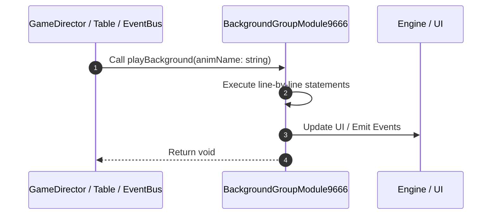

# 📖 `BackgroundGroupModule9666.playBackground()`

<!-- convention-summary-start -->
### BackgroundGroupModule9666.playBackground Line-by-Line Method Walkthrough Summary

- **Core Architecture / Purpose**: Technical reference, API contract, and integration guide for BackgroundGroupModule9666.playBackground Line-by-Line Method Walkthrough.
- **Key Mechanisms & Design**: Encapsulates core algorithms, event hooks, and performance optimizations within the slot framework runtime.
- **Domain Capabilities**: game_implement, 03_methods
- **Scope & Code Paths**: `file:///C:/Users/ADMIN/lamnino/cc20-new-all-in-one/assets/cc-release-slot/cc1-red-cliff/scripts/Gui/BackgroundGroupModule9666.ts`
- **Related Docs**: [Master Index](../INDEX.md)
<!-- convention-summary-end -->


---

## 1. Method Signature & Overview

```typescript
public playBackground(animName: string): void
```

- **Declaring Class**: `BackgroundGroupModule9666` ([`BackgroundGroupModule9666.ts`](file:///C:/Users/ADMIN/lamnino/cc20-new-all-in-one/assets/cc-release-slot/cc1-red-cliff/scripts/Gui/BackgroundGroupModule9666.ts))
- **Source Range**: Lines 39 to 45
- **Execution Cost**: $O(1)$ synchronous logic or timer Promise.

---

## 2. Complete Source Implementation

```typescript
	playBackground(animName: string): void {
		if (!this.background || this._currentAnim === animName) {
			return;
		}
		this._currentAnim = animName;
		this.background.setAnimation(0, animName, true);
	}
```

---

## 3. Line-by-Line Code Breakdown

| Line # | Code Snippet | Technical Analysis & Engine Behavior |
| :---: | :--- | :--- |
| **39** | `playBackground(animName: string): void {` | Method entry signature declaring `playBackground(animName: string)` returning `void`. |
| **40** | `if (!this.background \|\| this._currentAnim === animName) {` | Conditional guard evaluating branching prerequisite. |
| **41** | `return;` | Returns value or promise to calling sequence. |
| **42** | `}` | Scope boundary closing block. |
| **43** | `this._currentAnim = animName;` | Executes core logic. |
| **44** | `this.background.setAnimation(0, animName, true);` | Executes core logic. |
| **45** | `}` | Scope boundary closing block. |

---

## 4. Execution Call Graph & Sequence


